# DOKUMEN KEBUTUHAN PERANGKAT LUNAK (SRS)
# SISTEM INFORMASI MANAJEMEN MADRASAH TERPADU (SIM-MADRASAH)

| | |
|---|---|
| **Jenis Dokumen** | Software Requirements Specification (SRS) / Term of Reference (ToR) |
| **Versi** | 2.0 (Revisi Enterprise & AI-Ready) |
| **Status** | Final Draft — siap diserahkan ke tim pengembang |
| **Target Pembaca** | Programmer, System Analyst, Kepala Madrasah, Yayasan |

---

## Daftar Isi

1. Ringkasan Eksekutif
2. Tujuan & Ruang Lingkup
3. Arsitektur Sistem
4. Modul Fungsional
5. Modul Kecerdasan Buatan (AI Layer)
6. Kebutuhan Non-Fungsional
7. Keamanan & Kepatuhan Data
8. Arsitektur Antarmuka (UI/UX)
9. Kamus Data (Data Dictionary)
10. Aturan Bisnis (Business Rules)
11. Entity-Relationship Diagram (ERD)
12. Matriks Hak Akses (RBAC)
13. Tumpukan Teknologi (Tech Stack)
14. Rencana Implementasi (Roadmap)
15. Wireframe Referensi
16. Lampiran & Glosarium

---

## 1. Ringkasan Eksekutif

SIM-Madrasah adalah **sistem informasi manajemen internal** yang berfungsi sebagai lapisan (*buffer layer*) antara operasional harian madrasah dan sistem pusat Kementerian Agama — [EMIS GTK](https://emisgtk.kemenag.go.id/pembelajaran/jadwal-model/), EMIS 4.0, dan Verval PD.

Prinsip utamanya adalah **single source of input**: setiap data (siswa, guru, jadwal) cukup diinput satu kali di sistem internal, lalu:

- disinkronkan/diekspor ke portal resmi pemerintah sesuai format wajib, dan
- dimanfaatkan langsung untuk operasional harian (jadwal, absensi, persuratan, pelaporan).

**Perubahan mendasar pada versi 2.0** dibanding rancangan awal:

1. Ditambahkan **lapisan kecerdasan buatan (AI Layer)** — bukan sekadar "aplikasi CRUD", tetapi sistem yang membantu mengambil keputusan (deteksi dini siswa berisiko putus sekolah, optimasi jadwal otomatis, asisten virtual, OCR dokumen).
2. Ditambahkan **Kebutuhan Non-Fungsional** dan **Keamanan & Kepatuhan Data** — dua bagian yang sebelumnya tidak ada, padahal wajib untuk sistem yang menyimpan data pribadi anak (NIK, NISN, nama orang tua).
3. Strategi integrasi diarahkan **menuju API-first**, dengan ekspor CSV/Excel sebagai jalur cadangan (*fallback*) — bukan sebaliknya — mengikuti tren interoperabilitas sistem pemerintah yang berangsur membuka API resmi.
4. RBAC diperluas: ditambahkan peran **Kepala Madrasah** (approver, dashboard eksekutif) dan **Orang Tua/Wali** (akses terbatas, portal informasi anak).
5. Ditambahkan **Roadmap Implementasi bertahap** agar proyek dapat dianggarkan dan dieksekusi per fase, bukan "big bang".

---

## 2. Tujuan & Ruang Lingkup

**Tujuan:**
- Mengurangi beban input berulang bagi operator madrasah.
- Menyediakan data real-time untuk pengambilan keputusan Kepala Madrasah.
- Menjadi fondasi jangka panjang menuju madrasah berbasis data (*data-driven school management*).

**Ruang lingkup (in-scope):** Kesiswaan, SDM/PTK, Penjadwalan, Persuratan, Pelaporan, Portal Orang Tua tahap lanjut, Modul AI pendukung keputusan, **Nilai Dasar (bukan e-Rapor penuh), Ekstrakurikuler & Bimbingan Konseling** *(ditambahkan setelah audit fondasi entitas)*.

**Di luar lingkup (out-of-scope) untuk versi awal:** Modul keuangan/SPP, e-learning/LMS, ujian online, dan **cetak e-Rapor resmi** — direkomendasikan sebagai fase terpisah agar proyek tetap fokus dan realistis secara anggaran.

---

## 3. Arsitektur Sistem

Arsitektur **Modular Hybrid, Sinkronisasi Bertingkat, dan AI-Augmented**:

```text
                    ┌───────────────────────────────┐
                    │        AI LAYER (Modul 5)      │
                    │  Prediksi risiko • Asisten     │
                    │  virtual • OCR • Optimasi      │
                    └───────────────┬─────────────────┘
                                    │ (memanggil / dipanggil oleh)
 [ Database Internal Madrasah (PostgreSQL) ]
       │
       ├──> 1. Modul Kesiswaan & Rombel      --> Sinkronisasi ke Verval PD & EMIS 4.0
       ├──> 2. Modul SDM & Beban Mengajar    --> Sinkronisasi ke EMIS GTK
       ├──> 3. Modul Penjadwalan Cerdas      --> Operasional Internal
       ├──> 4. Modul Dokumen & Persuratan    --> Arsip Digital + e-Signature
       └──> 5. Portal Orang Tua/Wali (PWA)   --> Notifikasi WhatsApp/Email Gateway
```

### Strategi Interoperabilitas *(direvisi — sebelumnya berasumsi "API-first", ternyata tidak realistis)*

**Klarifikasi penting:** EMIS **tidak menyediakan API publik resmi**. Berdasarkan pengalaman langsung pengguna (percobaan 3–4 tahun lalu), endpoint EMIS *dapat* diakses secara teknis apabila proses login memakai sesi/akun madrasah yang sah — namun ini adalah **jalur tidak resmi/tidak terdokumentasi** (bukan API publik yang didukung Kemenag), sehingga strategi arsitektur diubah dari "API-first" menjadi **berjenjang berdasarkan tingkat keandalan**:

1. **Jalur utama & wajib — Export/Import Terverifikasi:** fungsi `Export to EMIS/Verval` yang menghasilkan file Excel/CSV bersih (*data hygiene*) sesuai template resmi terbaru. Ini jalur **paling stabil** karena tidak bergantung pada perilaku sistem pihak ketiga yang bisa berubah sewaktu-waktu, dan **wajib tersedia sejak Fase 1**, terlepas dari berhasil-tidaknya jalur lain.
2. **Jalur pelengkap (opsional, butuh validasi teknis) — Sinkronisasi via Sesi Akun Madrasah:** kemungkinan mengakses endpoint EMIS memakai sesi login akun resmi madrasah untuk mengotomasi input/tarik data. **Sebelum dibangun sebagai fitur produksi, wajib melalui tahap uji coba & verifikasi ulang** (endpoint, struktur respons, dan kestabilannya bisa saja sudah berubah sejak percobaan terakhir), dan sebaiknya dikonsultasikan legalitasnya (mengingat ini bukan API resmi, berpotensi melanggar ketentuan penggunaan sistem Kemenag jika diotomasi tanpa izin). Direkomendasikan sebagai **spike/riset teknis terpisah di Fase 5** (lihat Bab 14), bukan komitmen di jalur utama.
3. **Verval PD — Pengecekan NISN Publik:** untuk validasi kecocokan data siswa terhadap Verval, sistem dapat memanfaatkan fitur **cek NISN publik** yang disediakan resmi (per-siswa, bukan API massal) sebagai langkah validasi ringan sebelum data diekspor — mengurangi risiko data ditolak saat diunggah manual ke portal Verval.
4. **Idempotent Sync:** Setiap proses sinkron (baik ekspor manual maupun — bila tervalidasi — jalur sesi akun) mencatat `sync_log` (status sukses/gagal, timestamp, siapa yang menjalankan) agar dapat diaudit dan diulang tanpa duplikasi data.
5. **Database Mapping:** Standarisasi nama kolom (NISN, NIK, NPK) identik dengan format master data Kementerian, agar file ekspor selalu kompatibel tanpa perlu pemetaan ulang setiap kali template EMIS/Verval berubah.

> **Implikasi terhadap anggaran & timeline (Bab 14):** karena jalur otomatis (poin 2) belum terverifikasi keandalannya, estimasi Fase 1 tidak boleh menganggapnya sebagai fitur pasti tersedia. Sistem harus tetap berfungsi penuh hanya dengan jalur Export/Import manual + cek NISN publik.

---

## 4. Modul Fungsional

### A. Modul Kesiswaan & Rombel
- Manajemen Siswa Induk (PPDB → kelulusan), dengan validasi format NIK/NISN saat input (bukan saat ekspor) agar kesalahan terdeteksi lebih dini.
- Pengaturan Tingkat & Rombel, penentuan kurikulum, penetapan Wali Kelas.
- **Absensi Cerdas** dengan *smart default* (semua dianggap hadir, guru hanya menandai pengecualian).
- Kenaikan Kelas & Mutasi massal dengan validasi otomatis dan jejak audit (*audit trail*) siapa yang memproses.

### B. Modul Guru, Tenaga Kependidikan (PTK) & Jadwal
- Profil & riwayat PTK, beban tugas mengajar.
- **Smart Scheduling**: template jadwal fleksibel, deteksi bentrok otomatis, dan validasi linearitas jam mengajar sesuai sertifikasi guru.
- **Kehadiran Guru Berbasis Sesi Tatap Muka & Pemenuhan JTM** *(baru — direvisi dari rancangan awal "presensi mandiri guru")*: guru **tidak** melakukan presensi terpisah. Bukti kehadiran melekat pada tindakan wajib yang sudah ada — input presensi siswa di setiap sesi tatap muka. Siapa yang menginput, itulah yang tercatat hadir mengajar. Lihat detail mekanisme di Kamus Data Bab 9J dan Aturan Bisnis Bab 10 poin 12–15.
- **Pelaporan Izin Guru (H-1)**: guru melaporkan izin secara langsung/lisan/WA kepada Admin atau Kepala Madrasah minimal H-1, **kecuali kejadian mendesak** (mis. musibah keluarga) yang wajar dilaporkan pada hari yang sama atau setelahnya. Admin/Kepala Madrasah yang mencatatnya ke sistem — bukan guru yang menginput sendiri, agar tidak menambah beban administratif guru. Lihat Bab 9K.

### C. Modul Administrasi & Persuratan Digital
- Pembuatan SK, Surat Keterangan Aktif, Surat Tugas berbasis template.
- **e-Signature** (tanda tangan digital Kepala Madrasah) agar surat sah tanpa proses cetak-tanda tangan-scan manual.
- Nomor surat otomatis sesuai kaidah penomoran madrasah, tersimpan sebagai arsip digital tercari (*searchable archive*).
- **Draf Surat Teguran/Peringatan Otomatis** *(baru)*: dipicu saat pola ketidakhadiran/keterlambatan guru melampaui ambang kebijakan (Bab 10 poin 15), Kepala Madrasah tinggal meninjau dan menandatangani.

### D. Portal Orang Tua/Wali (baru — fase lanjutan)
- Akses terbatas (*read-only*) untuk melihat data absensi, jadwal, dan pengumuman anak mereka.
- Notifikasi otomatis via WhatsApp Business API/email saat anak tidak hadir tanpa keterangan.

### E. Modul Nilai Dasar *(baru — hasil audit fondasi entitas)*
- Input nilai per komponen (Tugas/UH/UTS/UAS) oleh guru mapel yang memang terjadwal mengajar mapel & rombel terkait.
- **Bukan e-Rapor resmi** — hanya menyediakan data terstruktur untuk dua kebutuhan: validasi Wali Kelas dan sinyal tambahan modul AI (Bab 5). Cetak rapor formal tetap di luar lingkup versi ini.

### F. Modul Ekstrakurikuler & Bimbingan Konseling *(baru — hasil audit fondasi entitas)*
- Pendaftaran & riwayat keanggotaan siswa di kegiatan ekstrakurikuler, dengan presensi terpisah dari presensi akademik.
- Pencatatan bimbingan konseling oleh Guru BK, dengan tingkat kerahasiaan (Umum/Rahasia) yang membatasi siapa saja yang bisa membaca catatan tertentu — lihat RBAC Bab 12.

---

## 5. Modul Kecerdasan Buatan (AI Layer)

Ini adalah penambahan inti dari revisi ini — mengubah sistem dari "pencatat data" menjadi "pendukung keputusan". Semua fitur berikut dirancang sebagai **layanan tambahan (add-on service)** yang memanggil model AI melalui API, sehingga tidak mengganggu stabilitas modul inti jika layanan AI sedang tidak tersedia.

| Fitur AI | Fungsi | Prioritas |
|---|---|---|
| **Deteksi Dini Siswa Berisiko** | Menganalisis pola absensi & nilai untuk menandai siswa berisiko tidak naik kelas/putus sekolah, lalu memunculkan peringatan ke Wali Kelas | Tinggi |
| **Optimasi Jadwal Otomatis** | Menghasilkan usulan jadwal awal yang meminimalkan bentrok dan jam kosong guru, sebagai titik awal yang lalu disempurnakan manual | Tinggi |
| **Asisten Virtual Admin (Chatbot)** | Menjawab pertanyaan operator/guru seputar prosedur internal (mis. "bagaimana cara mutasi siswa?") dan membantu mengisi form via percakapan | Sedang |
| **OCR & Ekstraksi Dokumen** | Membaca dokumen scan (akta kelahiran, KK, ijazah) dan mengisi form otomatis, mengurangi input manual | Sedang |
| **Draf Surat Otomatis** | Menghasilkan draf SK/Surat Tugas dari instruksi singkat, tetap memerlukan review manusia sebelum ditandatangani | Sedang |
| **Anomali Data (Data Hygiene)** | Menandai data mencurigakan sebelum ekspor ke EMIS/Verval (mis. NIK tidak 16 digit, tanggal lahir tidak wajar) | Tinggi |

**Prinsip desain AI (wajib dipatuhi tim pengembang):**
1. **Human-in-the-loop** — AI hanya memberi rekomendasi/draf; keputusan akhir (approve/reject) selalu di tangan manusia (Wali Kelas/Admin/Kepala Madrasah).
2. **Tidak ada keputusan otomatis penuh** untuk hal yang berdampak pada status siswa (naik kelas, kelulusan, drop out) — AI hanya memberi sinyal peringatan.
3. **Data anak tidak dikirim ke penyedia AI pihak ketiga tanpa anonimisasi**, kecuali penyedia tersebut sudah terikat perjanjian kerahasiaan data (DPA) dan sesuai UU PDP.
4. Setiap keluaran AI diberi label jelas "**Hasil AI — perlu verifikasi**" pada antarmuka, agar pengguna tidak menganggapnya sebagai kebenaran mutlak.

---

## 6. Kebutuhan Non-Fungsional

Bagian ini sebelumnya tidak ada pada rancangan awal, padahal wajib untuk sistem enterprise.

| Kategori | Kebutuhan Minimum |
|---|---|
| **Performa** | Waktu muat halaman < 2 detik untuk 95% request; pencarian data siswa < 1 detik untuk basis data hingga 5.000 siswa |
| **Ketersediaan (Availability)** | Uptime ≥ 99% pada jam operasional madrasah; backup otomatis harian |
| **Skalabilitas** | Arsitektur harus mendukung multi-tenant (untuk yayasan dengan beberapa madrasah) tanpa perubahan struktur database besar |
| **Kompatibilitas** | Responsif di desktop, laptop, dan tablet; mendukung koneksi internet lambat (mode ringan/*low-bandwidth*) mengingat lokasi madrasah bervariasi |
| **Auditability** | Setiap perubahan data penting (nilai, status siswa, absensi) tercatat di `audit_log` (siapa, kapan, apa yang diubah, nilai sebelum/sesudah) |
| **Usability** | Operator dengan literasi digital dasar dapat menggunakan fitur inti tanpa pelatihan lebih dari 1 hari |
| **Maintainability** | Kode mengikuti standar penamaan konsisten, terdokumentasi, dan diuji otomatis (*unit test* minimal untuk modul validasi & sinkronisasi) |

---

## 7. Keamanan & Kepatuhan Data

Karena sistem menyimpan data pribadi anak (NIK, NISN, nama orang tua), bagian ini bersifat wajib, bukan opsional.

- **Kepatuhan UU PDP No. 27/2022:** Data pribadi siswa/pegawai hanya diakses oleh peran yang berwenang; wajib ada mekanisme persetujuan (consent) orang tua untuk data yang dibagikan ke pihak ketiga.
- **Enkripsi:** Data sensitif (NIK) dienkripsi saat disimpan (*encryption at rest*) dan saat dikirim (*TLS/HTTPS*).
- **Otentikasi:** Wajib password kuat + opsi 2FA untuk peran Admin dan Kepala Madrasah.
- **Otorisasi berlapis:** RBAC di level aplikasi **dan** di level database. **Sejak keputusan multi-tenant di Tahap 2 (Bab 9P, Bab 10 poin 23-26), ini bukan lagi "bila multi-tenant" — isolasi antar `id_madrasah` wajib ditegakkan di level database (row-level security/global scope) untuk seluruh entitas akar tenant, tidak terkecuali.**
- **Backup & Disaster Recovery:** Backup harian otomatis, disimpan di lokasi terpisah dari server utama, dengan uji pemulihan (*restore test*) berkala.
- **Audit Trail:** Seluruh aksi CRUD pada data sensitif tercatat dan tidak dapat dihapus oleh pengguna biasa.
- **Retensi Data:** Data siswa yang lulus/mutasi tidak dihapus, melainkan diarsipkan (`status_siswa` = Lulus/Mutasi) sesuai kebutuhan riwayat historis dan regulasi arsip pendidikan.

---

## 8. Arsitektur Antarmuka (UI/UX)

Mengadaptasi pola dashboard EMIS GTK/EMIS 4.0 namun disederhanakan: Header, Sidebar Navigasi, Main Content.

### Struktur Navigasi (Sidebar)

- **MADRASAH** — Profil Madrasah, Tingkat Pendidikan, Rombel, Pengaturan Jadwal
- **KESISWAAN** — Data Siswa Induk, Absensi, Kenaikan Kelas & Kelulusan, Mutasi
- **GURU & TENDIK** — Data Pegawai, Tugas Tambahan
- **PERSURATAN** — Buat Surat, Arsip Surat, Template
- **WAWASAN (Insight/AI)** — Dashboard Prediksi, Peringatan Dini, Rekomendasi Jadwal *(baru)*
- **REFERENSI** — Mata Pelajaran, Hari Libur
- **KELOLA AKUN** — Manajemen Pengguna & Hak Akses

### Standar Komponen Halaman

1. **Filter Konteks Global** (Tahun Ajaran & Semester) di bagian atas — mencegah kesalahan edit data lampau.
2. **Tabel Data Interaktif** — pencarian instan, filter dropdown, ikon aksi (Detail/Edit/Hapus).
3. **Alert & Peringatan Dini** — termasuk peringatan hasil AI (ditandai ikon khusus agar berbeda dari validasi sistem biasa).
4. **Split-Screen Layout** untuk Kenaikan Kelas (drag-and-drop / seleksi massal antar-rombel).
5. **Dashboard Eksekutif** untuk peran Kepala Madrasah — ringkasan angka kunci (jumlah siswa aktif, tingkat kehadiran, siswa berisiko) dalam satu layar.

---

## 9. Kamus Data (Data Dictionary)

### A. Entitas Kesiswaan (Tabel: `siswa`)
- `id_siswa` (PK, UUID)
- `id_madrasah` (FK ke `madrasah`, Bab 9P — **wajib**, kunci isolasi tenant utama entitas ini)
- `nik` (16 digit, terenkripsi)
- `nisn`
- `nama_lengkap`
- `tempat_lahir`, `tanggal_lahir`
- `jenis_kelamin` (L/P)
- `agama`
- `nama_ibu_kandung` (wajib untuk validasi Dukcapil/Verval)
- `status_siswa` (Aktif, Lulus, Mutasi Keluar, Drop Out)
- `alamat_detail` *(baru)* — teks bebas untuk RT/RW/jalan/nomor rumah (bagian yang memang tidak perlu distandarisasi)
- `id_desa` *(baru, FK ke `master_desa`)* — menggantikan field alamat teks bebas yang sebelumnya **tidak ada sama sekali** di rancangan; distandarisasi penuh 4 level demi kompatibilitas kode wilayah EMIS/Verval
- `skor_risiko_ai` *(baru — nullable, diisi oleh modul AI, bukan input manual)*
- `created_at`, `updated_at`, `updated_by` *(baru — untuk audit trail)*

### A.1 Entitas Master Wilayah *(baru — standarisasi penuh 4 level, mengikuti struktur kode wilayah Kemendagri yang juga dipakai EMIS/Verval)*
- `master_provinsi`: `id_provinsi` (PK), `kode_provinsi`, `nama_provinsi`
- `master_kabupaten`: `id_kabupaten` (PK), `id_provinsi` (FK), `kode_kabupaten`, `nama_kabupaten`
- `master_kecamatan`: `id_kecamatan` (PK), `id_kabupaten` (FK), `kode_kecamatan`, `nama_kecamatan`
- `master_desa`: `id_desa` (PK), `id_kecamatan` (FK), `kode_desa`, `nama_desa`
- Data awal (*seed*) keempat tabel ini wajib diimpor dari sumber resmi Kemendagri/Kemenag sebelum modul Kesiswaan digunakan produksi — bukan diinput manual satu per satu oleh Admin.
- **Field alamat yang sama berlaku juga untuk `pegawai`** (lihat Bab 9B) — konsisten satu standar wilayah untuk seluruh entitas yang punya alamat.

### B. Entitas Guru & Tendik (Tabel: `pegawai`) *(diperbaiki — lihat penjelasan penting di bawah)*
- `id_pegawai` (PK)
- `id_madrasah` (FK ke `madrasah`, Bab 9P — **wajib**; satu pegawai = satu madrasah per akun, lihat catatan login tenant di Bab 9P)
- `nik` (16 digit, terenkripsi)
- `nip`, `npk`
- `nama_lengkap_gelar`
- `status_kepegawaian` (PNS, Non-PNS, Honorer)
- `tugas_utama` *(disederhanakan)* — hanya **"Guru"** atau **"Tendik"**. Ini murni kategori kepegawaian dasar (apakah orang ini mengajar atau tidak), **bukan** tempat menyimpan jabatan/tugas tambahan.
- `alamat_detail`, `id_desa` *(sama seperti `siswa` — lihat Bab 9A.1)*
- `mapel_sertifikasi` *(nullable)* — array/tabel pivot ke `mata_pelajaran`, dipakai memvalidasi linearitas jam mengajar yang dijanjikan Bab 4B

> **Koreksi penting — hasil klarifikasi ulang:** rancangan sebelumnya keliru menaruh "Guru BK" dan "Pembina Ekstrakurikuler" sebagai nilai `tugas_utama`, dan versi RBAC sebelumnya (revisi pertama Bab 12) juga masih keliru menaruh "Kepala Madrasah", "Admin Madrasah", dan "Operator Kesiswaan" sebagai satu nilai `Peran` eksklusif. **Keduanya salah dengan alasan yang sama**: di lapangan, **Guru adalah satu entitas tunggal** yang dapat menyandang kombinasi jabatan/tugas tambahan apa pun secara bersamaan — termasuk menjadi Kepala Madrasah (paling umum: Kepala Madrasah tetap seorang guru aktif mengajar, bukan jabatan struktural terpisah), menjadi Operator Kesiswaan (lazim di madrasah kecil dengan staf terbatas), sekaligus Wali Kelas, sekaligus Pembina Ekstrakurikuler. Seluruh jabatan/tugas tambahan ini **tidak boleh disimpan sebagai field tunggal di `pegawai`** — lihat entitas `penugasan_jabatan` di bawah, yang menggantikan pendekatan field tunggal tersebut sepenuhnya.

### B.1 Entitas Penugasan Jabatan *(baru — model terpadu untuk jabatan yang TIDAK punya "rumah" alami di entitas lain)*
Satu tabel yang menaungi jabatan/tugas tambahan yang cakupannya **seluruh madrasah** (bukan terikat ke satu rombel/ekstrakurikuler spesifik yang sudah punya FK sendiri):

- `penugasan_jabatan`: `id_penugasan` (PK), `id_pegawai` (FK), `jenis_jabatan` (enum: **Kepala Madrasah, Admin Madrasah, Operator Kesiswaan, Guru BK**), `id_tahun` (FK — penugasan berlaku per tahun ajaran, karena jabatan seperti Kepala Madrasah lazim berganti tiap periode), `tanggal_mulai`, `tanggal_selesai` (nullable), `status` (Aktif/Berakhir)
- Satu pegawai bisa punya **banyak baris aktif sekaligus** di tabel ini (itulah intinya) — mis. satu baris `jenis_jabatan` = "Kepala Madrasah", satu baris lagi `jenis_jabatan` = "Guru BK", keduanya `status` = "Aktif" pada tahun ajaran yang sama, untuk `id_pegawai` yang sama.
- **Sengaja TIDAK mencakup Wali Kelas dan Pembina Ekstrakurikuler** — dua jabatan itu sudah punya sumber kebenaran sendiri yang lebih tepat: `rombel.id_wali_kelas` (Bab 9C) dan `ekstrakurikuler.id_pembina` (Bab 9N). Menduplikasinya ke sini akan menciptakan dua sumber kebenaran yang berisiko saling bertentangan — dihindari sepenuhnya.
- **"Guru Mapel" dan "Guru Kelas" juga sengaja TIDAK ada di enum ini** — keduanya bukan jabatan yang perlu ditugaskan secara terpisah, melainkan **konsekuensi otomatis dari baris `jadwal_pelajaran`** yang dimiliki pegawai tersebut (lihat penjelasan pola "Guru Kelas vs Guru Mapel" di Bab 10 poin 21).
- **Ringkasan lengkap seluruh sumber status jabatan** (supaya tidak ambigu di mana mencari status apa):

  | Jabatan/Status | Sumber Kebenaran | Cakupan |
  |---|---|---|
  | Kepala Madrasah, Admin Madrasah, Operator Kesiswaan, Guru BK | `penugasan_jabatan.jenis_jabatan` | Seluruh madrasah |
  | Wali Kelas | `rombel.id_wali_kelas` | Per rombel |
  | Pembina Ekstrakurikuler | `ekstrakurikuler.id_pembina` | Per ekstrakurikuler |
  | Guru Kelas / Guru Mapel (pola mengajar) | `jadwal_pelajaran` (pola distribusi baris, lihat Bab 10 poin 21) | Per rombel+mapel+semester |

### C. Entitas Akademik & Referensi
- `tahun_ajaran` *(diperbaiki — granularitas semula per-semester berisiko membuat rombel "berpindah" palsu tiap semester)*: `id_tahun` (PK), `id_madrasah` (FK ke `madrasah`, Bab 9P — **wajib**, tiap madrasah punya kalender tahun ajaran sendiri), `nama_tahun` (contoh: "2026/2027"), `status_aktif`. **Satu baris mewakili satu tahun ajaran penuh (2 semester), bukan per-semester.** `semester` dipindah menjadi field di `jadwal_pelajaran` (lihat di bawah).
  > **Asumsi yang diambil** (perlu dikonfirmasi ke pihak madrasah sebelum backend dibangun): komposisi `rombel` — siswa dan wali kelas — **tetap sama** sepanjang satu tahun ajaran penuh; yang berubah antar semester hanyalah jadwal mata pelajaran. Jika ternyata ada madrasah yang mengubah komposisi rombel di tengah tahun ajaran (pergantian semester), asumsi ini perlu direvisi bersama pihak terkait.
- `mata_pelajaran`: `id_mapel`, `id_madrasah` (FK — **wajib**; daftar mapel bisa berbeda kebijakan antar madrasah, mis. muatan lokal), `kode_mapel`, `nama_mapel`, `kelompok_mapel`
- `tingkat_pendidikan`: `id_tingkat` (PK), `nama_tingkat` (contoh: Kelas 10 / Kelas III), `urutan` (integer, dipakai untuk memvalidasi kenaikan berjenjang). **Tidak punya `id_madrasah`** — ini referensi nasional bersama (jenjang pendidikan sama untuk semua madrasah), lihat tabel kategori Bab 9P.
- `rombel`: `id_rombel`, `id_madrasah` (FK — **wajib**), `nama_rombel` (contoh: 10-A), `id_tingkat` (FK), `id_wali_kelas` (FK), `id_tahun` (FK ke `tahun_ajaran` — **tahun penuh, bukan per-semester**, lihat asumsi di atas)
- `jadwal_pelajaran` *(baru — diformalkan, sebelumnya hanya hidup di ERD & Aturan Bisnis tanpa entri Kamus Data resmi)*: `id_jadwal` (PK), `id_rombel` (FK — tenant diwarisi lewat sini, lihat Bab 9P), `id_pegawai` (FK, guru pengajar), `id_mapel` (FK), `semester` *(baru, dipindah dari `tahun_ajaran`)* — "Ganjil"/"Genap", `hari`, `jam_mulai`, `jam_selesai`. Kombinasi `id_pegawai` + `hari` + `jam_mulai` + `semester` harus unik (Bab 10 poin 3) — **dan** validasi tambahan: `id_rombel` dan `id_pegawai` wajib berasal dari `id_madrasah` yang sama (mencegah data satu madrasah dijadwalkan memakai guru madrasah lain).

### D. Entitas Presensi Siswa *(baru — diformalkan, sebelumnya hanya disebut di Aturan Bisnis tanpa entri Kamus Data resmi)*
- `absensi_siswa`: `id_absensi` (PK), `tanggal`, `id_siswa` (FK), `id_rombel` (FK), `id_sesi` (FK ke `sesi_tatap_muka` — **kunci yang membuat presensi unik per sesi/mapel, bukan per hari**, lihat Bab 9J), `status` (Hadir/Sakit/Izin/Alpa)
- Kombinasi `id_siswa` + `id_sesi` harus unik — satu siswa satu status per sesi tatap muka. Ini yang memungkinkan rekap kehadiran siswa per mata pelajaran (mis. siswa sering alpa khusus di jam tertentu), bukan cuma per hari.

### E. Entitas Keanggotaan Rombel *(diperbaiki — sebelumnya pivot sederhana tanpa riwayat)*
Tabel `anggota_rombel` sebelumnya hanya menyimpan `id_siswa` + `id_rombel`, sehingga tidak bisa merepresentasikan kapan siswa pindah rombel atau naik kelas. Struktur baru:
- `id_anggota` (PK)
- `id_siswa` (FK)
- `id_rombel` (FK)
- `tanggal_mulai` (tanggal mulai efektif di rombel ini)
- `tanggal_selesai` (nullable — diisi otomatis saat siswa pindah/naik/keluar; `NULL` berarti masih aktif di rombel ini)
- `status_keanggotaan` (Aktif, Pindah Rombel, Naik Kelas, Tinggal Kelas, Lulus, Keluar)
- `jenis_perpindahan` (Awal Masuk, Pindah Rombel, Kenaikan Tingkat, Mutasi Masuk)
- `status_persetujuan` *(baru)* — (Tidak Perlu, Menunggu Persetujuan, Disetujui, Ditolak). Default "Tidak Perlu" untuk kenaikan kelas massal dan pindah rombel sesama tingkat; wajib "Menunggu Persetujuan" untuk pindah rombel lintas tingkat.
- `diajukan_oleh` *(baru, FK ke `id_pegawai`)* — Operator Kesiswaan yang mengajukan.
- `disetujui_oleh` *(baru, nullable, FK ke `id_pegawai`)* — diisi Kepala Madrasah saat approve/reject.
- `tanggal_persetujuan` *(baru, nullable)*

> **Aturan turunan:** untuk 1 siswa, hanya boleh ada **maksimal satu baris** dengan `tanggal_selesai IS NULL` pada satu waktu — inilah yang menjamin "siswa hanya aktif di satu rombel" sekaligus tetap menyimpan seluruh riwayatnya. Baris dengan `status_persetujuan` = "Menunggu Persetujuan" **belum** dianggap aktif dan belum menutup baris lama (lihat Bab 10 poin 9).

### F. Entitas Pemetaan Kenaikan Kelas *(baru)*
- `pemetaan_kenaikan`: `id_pemetaan` (PK), `id_rombel_asal` (FK), `id_rombel_tujuan` (FK), `id_tahun_ajaran` (FK, tahun ajaran tujuan)
- Fungsinya: sebelum tombol "Proses Kenaikan Kelas" massal dijalankan, Admin/Operator terlebih dulu memetakan rombel asal → rombel tujuan (mis. 10-A tahun ini → 11-A tahun depan). Sistem memakai pemetaan ini untuk membuat baris `anggota_rombel` baru secara massal.

### G. Entitas Riwayat Mutasi *(baru, diperbarui dengan alur persetujuan)*
- `riwayat_mutasi`: `id_mutasi` (PK), `id_siswa` (FK), `jenis_mutasi` (Masuk/Keluar), `sekolah_asal` (diisi jika Mutasi Masuk), `sekolah_tujuan` (diisi jika Mutasi Keluar), `tanggal_mutasi`, `no_surat_mutasi`, `alasan`, `id_tahun_ajaran` (FK)
- `status_persetujuan` *(baru)* — (Menunggu Persetujuan, Disetujui, Ditolak). Setiap mutasi **wajib** melalui approval, tidak ada opsi "Tidak Perlu" seperti pada pindah rombel — karena mutasi selalu mengubah status resmi siswa.
- `diajukan_oleh` *(baru, FK ke `id_pegawai`)* — Operator Kesiswaan sebagai eksekutor yang menginput dan mengajukan.
- `disetujui_oleh` *(baru, nullable, FK ke `id_pegawai`)* — Kepala Madrasah yang memproses via akunnya sendiri.
- `tanggal_persetujuan` *(baru, nullable)*
- Menampung dua arah mutasi yang sebelumnya tidak punya tempat penyimpanan detail: siswa pindahan dari sekolah lain (non-PPDB) maupun siswa yang keluar karena pindah sekolah.

### H. Field Tambahan pada `siswa`
- `jalur_masuk` (PPDB Reguler / Mutasi Masuk) — *ditambahkan* agar laporan bisa memisahkan siswa hasil PPDB dari siswa pindahan, sesuai kebutuhan pelaporan Verval PD.

### I. Entitas Audit *(baru)*
- `audit_log`: `id_log` (PK), `id_user` (FK), `nama_tabel`, `id_record`, `aksi` (Create/Update/Delete), `data_sebelum` (JSON), `data_sesudah` (JSON), `timestamp`

### J. Entitas Sinkronisasi *(baru)*
- `sync_log`: `id_sync` (PK), `modul`, `status` (Sukses/Gagal), `jumlah_record`, `pesan_error`, `dijalankan_oleh`, `timestamp`

### K. Entitas Sesi Tatap Muka *(baru — dasar pemenuhan JTM & kehadiran guru)*
Dirancang khusus agar **kehadiran guru tidak memerlukan presensi mandiri terpisah** — bukti kehadiran melekat pada aktivitas mengajar yang sudah wajib dilakukan (input presensi siswa).

- `sesi_tatap_muka`: `id_sesi` (PK), `id_jadwal` (FK ke `jadwal_pelajaran` — acuan guru & jam yang seharusnya), `tanggal`
- `id_pegawai_pelaksana` (FK ke `pegawai`) — guru yang **benar-benar** menginput presensi siswa pada sesi ini; bisa berbeda dari guru yang tercatat di `id_jadwal`
- `waktu_input` (timestamp submit presensi, dibandingkan otomatis terhadap `jam_mulai`/`jam_selesai` pada `jadwal_pelajaran`)
- `is_guru_pengganti` (boolean, **dihitung otomatis** — `TRUE` jika `id_pegawai_pelaksana` ≠ `id_pegawai` pada `id_jadwal`; tidak dapat diedit manual)
- `id_izin_terkait` (FK nullable ke `izin_guru` — diisi otomatis jika penggantian ini sudah dilaporkan lebih dulu, lihat Bab 9K)
- `jurnal_materi` *(baru, nullable, teks bebas)* — materi/topik yang diajarkan pada sesi ini, diisi guru pelaksana setelah presensi siswa disimpan. Sengaja diletakkan sebagai kolom di entitas ini, bukan tabel terpisah, karena selalu satu-ke-satu dengan sesi dan tidak butuh riwayat tersendiri.
- `status_kehadiran_guru` (dihitung otomatis oleh sistem, bukan input manual):
  - **Tepat Waktu** — pelaksana = guru terjadwal, `waktu_input` dalam batas wajar dari `jam_mulai`
  - **Terlambat** — pelaksana = guru terjadwal, tapi `waktu_input` melewati ambang toleransi
  - **Digantikan Terjadwal** — `is_guru_pengganti = TRUE` dan `id_izin_terkait` terisi (izin sudah dilaporkan H-1 atau tercatat sebagai darurat yang sah)
  - **Digantikan Mendadak** — `is_guru_pengganti = TRUE` tetapi `id_izin_terkait` kosong (belum ada laporan izin apa pun — anomali yang perlu ditinjau Kepala Madrasah)
  - **Tidak Terlaksana** — tidak ada presensi siswa yang diinput sama sekali untuk sesi ini hingga batas waktu tertentu

> **Catatan penting:** status ini merefleksikan **kepatuhan administratif** (siapa yang menginput data), bukan pengawasan CCTV atas kehadiran fisik. Keduanya biasanya selaras, tapi tim pengembang dan Kepala Madrasah perlu memahami batasan ini agar tidak menganggapnya sebagai bukti mutlak.

### L. Entitas Izin Guru *(baru)*
- `izin_guru`: `id_izin` (PK), `id_pegawai` (FK, guru yang izin), `tanggal_izin`, `jenis_izin` (Direncanakan H-1 / Mendesak-Darurat), `alasan`, `id_pegawai_pengganti` (FK nullable, jika sudah ditentukan penggantinya di muka), `dilaporkan_pada` (timestamp), `dicatat_oleh` (FK ke `id_pegawai` — Admin/Kepala Madrasah yang menerima laporan dan menginput ke sistem)
- `saluran_pelaporan` *(baru)* — (Langsung/Tatap Muka, WA Pribadi Kepala Madrasah, WA Group) — **field informasional saja**, dicatat manual oleh yang menginput (bukan integrasi WhatsApp otomatis); berguna untuk konteks/audit, bukan pemicu logika sistem.
- `status_rekonsiliasi` *(baru)* — (Tepat Waktu, Terlambat) — dihitung otomatis berdasarkan selisih `dilaporkan_pada` terhadap `tanggal_izin` (lihat aturan jendela 1x24 jam, Bab 10 poin 14).
- **Bukan diinput oleh guru bersangkutan** — sesuai SOP lapangan, guru melapor lisan/WA (pribadi ke Kepala Madrasah atau via grup WA) kepada Admin atau Kepala Madrasah, yang kemudian mencatatkannya. Ini mencegah modul ini menjadi beban administratif baru bagi guru.
- Untuk kasus mendesak (mis. musibah keluarga), entri ini boleh dicatat **setelah** kejadian, dengan batas wajar maksimal **1x24 jam** sejak tanggal kejadian (lihat Bab 10 poin 14) — sistem tidak mensyaratkan pencatatan sebelum sesi berlangsung untuk kategori "Mendesak-Darurat".

### M. Entitas Nilai Dasar *(baru — sengaja minimal, bukan e-Rapor penuh)*
Dirancang secukupnya untuk dua kebutuhan yang sudah dijanjikan tapi belum punya fondasi data: (a) input Wali Kelas di akhir semester, (b) sinyal tambahan untuk deteksi dini AI (Bab 5) yang sebelumnya hanya berbasis absensi. **Bukan pengganti e-Rapor resmi** — cetak rapor formal tetap di luar lingkup versi ini (konsisten dengan pengecualian e-learning/ujian online di Bab 2).

- `komponen_nilai`: `id_komponen` (PK), `id_mapel` (FK), `nama_komponen` (mis. "Tugas", "Ulangan Harian", "UTS", "UAS"), `bobot` (persen, dipakai kalkulasi nilai akhir per mapel)
- `nilai_siswa`: `id_nilai` (PK), `id_siswa` (FK), `id_komponen` (FK), `id_rombel` (FK), `id_tahun` (FK), `semester` (Ganjil/Genap, konsisten dengan `jadwal_pelajaran` Bab 9C), `nilai` (numerik), `id_pegawai_penilai` (FK ke `pegawai` — guru yang menginput), `tanggal_input`
- Validasi tingkat aplikasi: `id_pegawai_penilai` harus guru yang memang terjadwal mengajar `id_mapel` (via `komponen_nilai` → `mata_pelajaran`) di `id_rombel` tersebut pada semester terkait — mencegah guru menilai mapel/rombel yang bukan tanggung jawabnya.

### N. Entitas Ekstrakurikuler & Bimbingan Konseling *(baru)*
- `ekstrakurikuler`: `id_ekstra` (PK), `id_madrasah` (FK — **wajib**), `nama_ekstra`, `id_pembina` (FK ke `pegawai` — pegawai mana pun dengan `tugas_utama` = "Guru", tidak dibatasi jabatan tambahan tertentu; status "Pembina" untuk ekstrakurikuler ini justru **didefinisikan oleh** keberadaan FK ini, bukan sebaliknya — lihat Bab 9B.1), `id_tahun` (FK)
- `keanggotaan_ekstra`: `id_keanggotaan` (PK), `id_siswa` (FK), `id_ekstra` (FK), `tanggal_mulai`, `tanggal_selesai` (nullable), `status` (Aktif/Keluar) — mengikuti pola riwayat yang sama seperti `anggota_rombel` (Bab 9D), bukan relasi langsung tanpa jejak waktu
- `absensi_ekstra`: `id_absensi_ekstra` (PK), `id_keanggotaan` (FK), `tanggal`, `status` (Hadir/Tidak Hadir) — terpisah dari `absensi_siswa` karena jadwal ekstrakurikuler tidak terikat `jadwal_pelajaran`/sesi tatap muka reguler
- `catatan_bk`: `id_catatan` (PK), `id_madrasah` (FK — **wajib, ditambahkan langsung** meski bisa diturunkan dari `id_siswa`, supaya *row-level security* Bab 10 poin 19 bisa memeriksa isolasi tenant **dan** kerahasiaan BK dalam satu policy tanpa join tambahan — lihat Bab 9P), `id_siswa` (FK), `id_pegawai_bk` (FK ke `pegawai` — pegawai dengan baris `penugasan_jabatan.jenis_jabatan` = "Guru BK" berstatus Aktif, lihat Bab 9B.1, bukan lagi merujuk `tugas_utama`), `tanggal`, `kategori` (Akademik/Perilaku/Pribadi/Sosial), `catatan` (teks), `tingkat_kerahasiaan` (Umum/Rahasia — "Rahasia" hanya bisa dibaca Guru BK bersangkutan dan Kepala Madrasah, tidak oleh Wali Kelas/Operator, lihat Bab 12)

### O. Entitas Persuratan *(baru — diformalkan; sebelumnya hanya disebut sebagai modul di Bab 4C tanpa entitas Kamus Data resmi, dirancang oleh agen frontend selama implementasi Tahap 1 dan terverifikasi baik, sekarang dijadikan bagian resmi SRS)*
- `profil_madrasah`: `id_profil` (PK — **bukan lagi singleton global**, lihat Bab 9P, sekarang satu baris per `id_madrasah`), `id_madrasah` (FK, unik — satu profil per madrasah), `nama_madrasah`, `kode_instansi`, `alamat`, `id_kepala_madrasah` (FK ke `pegawai`, nullable — untuk kasus Plt/Pjs dipakai field teks cadangan di bawah), `nama_kepala_madrasah_cadangan` (teks, dipakai kalau `id_kepala_madrasah` kosong atau perlu override nama non-pegawai terdaftar), `logo_url` (nullable)
- `template_surat`: `id_template` (PK), `id_madrasah` (FK — template surat spesifik per madrasah, tidak dibagi lintas tenant), `kode_template` (unik **per madrasah**, mis. "SKP-MUTASI", "SK-WALI-KELAS"), `nama_template`, `isi_template` (teks berisi placeholder `{{NAMA_SISWA}}` dsb.), `jenis_surat`
- `surat`: `id_surat` (PK), `id_madrasah` (FK — **wajib**, nomor surat berurutan dihitung per madrasah, bukan global lintas tenant), `nomor_surat` (unik **per `id_madrasah`**, format `421/{urutan}/{kode_instansi}/{tahun}` — `urutan` dihitung berurutan dari jumlah `surat` milik madrasah yang sama, **bukan** teks statis dan **bukan** dihitung lintas tenant), `id_template` (FK, nullable — surat bisa dibuat tanpa template), `perihal`, `isi_surat` (hasil render placeholder), `jenis_surat`, `status` (Draf/Menunggu TTD/Diterbitkan), `id_siswa_terkait` (FK nullable), `id_pegawai_terkait` (FK nullable), `id_tujuan_surat` (nullable, untuk surat keluar eksternal), `dibuat_oleh` (FK ke `pegawai`), `meta_penandatangan` (JSON, nullable — **snapshot** nama/NIP/jabatan penandatangan pada **saat tanda tangan dilakukan**, bukan referensi hidup ke `pegawai`, supaya dokumen historis tidak berubah retroaktif kalau Kepala Madrasah berganti setelah surat diterbitkan)
- **Prinsip kekekalan arsip legal:** begitu `status` = "Diterbitkan", `meta_penandatangan` **tidak boleh berubah lagi** meski data `pegawai` sumbernya (nama, NIP, jabatan) diedit di kemudian hari — inilah alasan dipakai snapshot, bukan FK langsung ke `pegawai` untuk data yang tercetak.
- **Kaitan dengan alur persetujuan (Bab 10 poin 9-11):** SKP (Surat Keputusan Pindah) untuk mutasi keluar diterbitkan lewat jalur "satu-klik approve+sign" — nomor surat dan snapshot penandatangan tetap **wajib** memakai mekanisme resmi yang sama seperti surat lain (bukan diimplementasikan ulang terpisah), untuk mencegah nomor surat bertabrakan **di dalam satu madrasah yang sama**.

### P. Entitas Madrasah — Akar Multi-Tenant *(baru — keputusan produk: multi-tenant sungguhan dibangun di Tahap 2, bukan ditunda ke Fase 5 seperti rencana awal)*
- `madrasah`: `id_madrasah` (PK), `nama_madrasah`, `npsn` (unik, Nomor Pokok Sekolah Nasional), `alamat`, `id_desa` (FK ke `master_desa`, lihat Bab 9A.1), `status_aktif` (boolean — madrasah bisa dinonaktifkan tanpa dihapus, mis. tutup/merger)
- **Prinsip isolasi tenant:** setiap entitas operasional (bukan referensi nasional bersama) terikat langsung atau tidak langsung ke satu `id_madrasah`. Pembagian berikut wajib diikuti — jangan menambah `id_madrasah` ke entitas yang seharusnya tetap bersama lintas tenant, dan jangan lupa menambahkannya ke entitas yang seharusnya terisolasi:

  | Kategori | Entitas | `id_madrasah`? |
  |---|---|---|
  | **Referensi nasional bersama** (tidak boleh diisolasi, dipakai lintas tenant) | `master_provinsi`, `master_kabupaten`, `master_kecamatan`, `master_desa`, `tingkat_pendidikan` | Tidak ada FK — data ini identik untuk semua madrasah |
  | **Akar tenant** (FK `id_madrasah` langsung, wajib) | `siswa`, `pegawai`, `rombel`, `tahun_ajaran`, `mata_pelajaran`, `ekstrakurikuler`, `catatan_bk`, `profil_madrasah`, `template_surat`, `surat` | Ya, langsung |
  | **Turunan tenant** (mewarisi isolasi lewat FK ke entitas akar, tidak perlu kolom `id_madrasah` sendiri) | `anggota_rombel`, `jadwal_pelajaran`, `sesi_tatap_muka`, `absensi_siswa`, `izin_guru`, `komponen_nilai`, `nilai_siswa`, `keanggotaan_ekstra`, `absensi_ekstra`, `riwayat_mutasi`, `pemetaan_kenaikan`, `penugasan_jabatan`, `audit_log`, `sync_log` | Tidak langsung — tenant ditentukan lewat relasi (mis. `jadwal_pelajaran` → `rombel` → `madrasah`) |

- `catatan_bk` **sengaja diberi `id_madrasah` langsung** (bukan hanya lewat `siswa`) supaya kebijakan *row-level security* (Bab 10 poin 19) bisa memeriksa isolasi tenant **dan** kerahasiaan BK dalam satu policy tanpa join tambahan — pertimbangan performa dan kesederhanaan penegakan keamanan sekaligus.
- **Login dan konteks tenant:** setiap sesi login (`pegawai`) terikat ke tepat satu `id_madrasah` lewat relasi `pegawai.id_madrasah`. Tidak ada pegawai yang beroperasi lintas madrasah dalam satu sesi — kalau seseorang bekerja di lebih dari satu madrasah (jarang tapi mungkin di satu yayasan), dia butuh akun `pegawai` terpisah per madrasah, bukan satu akun lintas tenant.

---

## 10. Aturan Bisnis (Business Rules)

1. **Rombel & Siswa:** 1 siswa hanya di 1 rombel per tahun ajaran aktif; 1 rombel memiliki banyak siswa (*one-to-many* via tabel riwayat).
2. **Pegawai & Rombel (Wali Kelas):** 1 rombel maksimal 1 wali kelas; 1 pegawai maksimal wali kelas di 1 rombel per tahun ajaran aktif.
3. **Penjadwalan:** kombinasi `id_pegawai` + `hari` + `jam_mulai` + `semester` harus unik — sistem menolak otomatis jika bentrok.
4. **AI — Skor Risiko:** `skor_risiko_ai` hanya dapat ditulis oleh proses sistem/AI, tidak dapat diedit manual oleh pengguna (mencegah manipulasi data).
5. **Audit:** setiap `UPDATE`/`DELETE` pada tabel `siswa`, `pegawai`, dan `absensi_siswa` wajib memicu entri baru di `audit_log` sebelum transaksi dianggap selesai.

### Aturan Tambahan — Kenaikan Kelas, Perpindahan Rombel & Mutasi *(baru)*

6. **Satu keanggotaan aktif per siswa:** pada tabel `anggota_rombel`, sistem harus menolak insert baru untuk siswa yang masih memiliki baris dengan `tanggal_selesai IS NULL`, kecuali proses tersebut secara eksplisit menutup (mengisi `tanggal_selesai`) baris lama terlebih dahulu dalam satu transaksi.

7. **Kenaikan kelas/tingkat (akhir tahun ajaran):**
 - Diproses secara massal berdasarkan tabel `pemetaan_kenaikan` (rombel asal → rombel tujuan).
 - Sistem menutup baris `anggota_rombel` lama (`status_keanggotaan` = "Naik Kelas" atau "Tinggal Kelas") dan membuka baris baru di rombel tujuan (`jenis_perpindahan` = "Kenaikan Tingkat").
 - Validasi berjenjang: rombel tujuan wajib memiliki `tingkat_pendidikan.urutan` = urutan rombel asal **+ 1** (mencegah salah pemetaan, mis. 10-A ke 9-A).
 - Siswa dengan status "Tinggal Kelas" tetap dipetakan ke rombel di tingkat yang sama tahun berikutnya, ditandai eksplisit agar mudah dilaporkan terpisah dari kenaikan reguler.

8. **Pindah rombel — tingkat sama (mis. 10-A ke 10-B):**
 - Berlaku dalam tahun ajaran berjalan, tidak menunggu akhir tahun.
 - Sistem menutup baris `anggota_rombel` lama (`status_keanggotaan` = "Pindah Rombel") dan membuka baris baru pada rombel tujuan (`jenis_perpindahan` = "Pindah Rombel"), dengan `tanggal_mulai` = tanggal efektif pindah.
 - Riwayat absensi pada `absensi_siswa` sebelum tanggal pindah tetap terhitung ke rombel lama (karena `id_rombel` pada `absensi_siswa` dicatat per tanggal, bukan diturunkan ulang dari status keanggotaan saat ini).

9. **Pindah rombel — lintas tingkat di luar periode kenaikan reguler** (mis. siswa dipindah tingkat karena akselerasi/pengulangan di tengah tahun): **wewenang mengajukan ada di Operator Kesiswaan, tetapi wajib disetujui Kepala Madrasah sebelum berlaku efektif.** Alurnya:
 - Operator Kesiswaan mengajukan perpindahan: sistem membuat baris `anggota_rombel` baru dengan `status_persetujuan` = "Menunggu Persetujuan", `jenis_perpindahan` = "Kenaikan Tingkat", dan `diajukan_oleh` terisi otomatis. **Baris lama siswa belum ditutup** pada tahap ini — siswa masih tercatat aktif di rombel asal.
 - Kepala Madrasah menerima notifikasi pengajuan (melalui menu approval di dashboard eksekutif, Bab 8).
 - **Jika disetujui:** `status_persetujuan` = "Disetujui", `disetujui_oleh` dan `tanggal_persetujuan` terisi, dan **baru pada titik ini** sistem menutup baris lama (`tanggal_selesai` = tanggal persetujuan, `status_keanggotaan` = "Naik Kelas"/"Tinggal Kelas") dan mengaktifkan baris baru (`status_keanggotaan` = "Aktif").
 - **Jika ditolak:** `status_persetujuan` = "Ditolak", baris baru tidak pernah aktif (tidak menutup baris lama), dan sistem mencatat alasan penolakan. Siswa tetap berada di rombel asal tanpa gangguan.
 - Selama status "Menunggu Persetujuan", pengajuan tampil sebagai item tertunda di dashboard Operator maupun Kepala Madrasah agar tidak terlupa.
 - Aksi persetujuan/penolakan tercatat di `audit_log` sebagai bukti jejak kewenangan.

10. **Mutasi masuk (non-PPDB):**
 - **Operator Kesiswaan sebagai eksekutor**: menginput data mutasi masuk (data siswa, sekolah asal, dokumen pendukung) ke `riwayat_mutasi` dengan `jenis_mutasi` = "Masuk" dan `status_persetujuan` = "Menunggu Persetujuan". Pada tahap ini siswa **belum** berstatus resmi terdaftar/aktif — datanya tersimpan sebagai pengajuan.
 - **Persetujuan oleh Kepala Madrasah**, wajib dilakukan melalui akun Kepala Madrasah sendiri (bukan dititipkan ke akun lain) — mengisi `disetujui_oleh` dan `tanggal_persetujuan`.
 - **Jika disetujui:** dalam satu transaksi, sistem (a) mengubah `status_persetujuan` = "Disetujui", (b) membuat baris baru `siswa` berstatus "Aktif" dengan `jalur_masuk` = "Mutasi Masuk", dan (c) membuat baris `anggota_rombel` pertama (`jenis_perpindahan` = "Mutasi Masuk").
 - **Jika ditolak:** `status_persetujuan` = "Ditolak" beserta alasan; tidak ada perubahan apa pun pada data siswa/rombel.
 - **Pencatatan log ganda:** setiap aksi pengajuan maupun persetujuan/penolakan tercatat di `audit_log` dengan `id_user` yang jelas — sehingga jejak aktivitas **tercatat di kedua akun** (akun Operator sebagai pengaju, akun Kepala Madrasah sebagai penyetuju), bukan tergabung jadi satu entri anonim.

11. **Mutasi keluar (pindah sekolah):**
 - **Operator Kesiswaan sebagai eksekutor**: mengajukan mutasi keluar ke `riwayat_mutasi` (`jenis_mutasi` = "Keluar") dengan `sekolah_tujuan` dan `no_surat_mutasi` wajib diisi, `status_persetujuan` = "Menunggu Persetujuan". Status siswa **belum berubah** pada tahap ini — siswa masih aktif normal (tetap muncul di absensi/jadwal) sampai disetujui.
 - **Persetujuan oleh Kepala Madrasah** via akunnya sendiri. **Jika disetujui:** dalam satu transaksi, sistem menutup baris `anggota_rombel` aktif siswa (`status_keanggotaan` = "Keluar") dan mengubah `siswa.status_siswa` menjadi "Mutasi Keluar" — mencegah kondisi siswa tercatat keluar namun masih muncul aktif di rombel, atau sebaliknya. **Jika ditolak:** tidak ada perubahan status siswa.
 - Siswa berstatus "Mutasi Keluar" tidak dapat lagi menjadi target input absensi maupun penjadwalan baru (validasi tingkat aplikasi).
 - Sama seperti mutasi masuk, seluruh aksi pengajuan dan persetujuan tercatat di `audit_log` atas nama masing-masing akun (Operator & Kepala Madrasah) agar jejak kewenangan jelas dan dapat ditelusuri terpisah.

### Aturan Tambahan — Kehadiran Guru, JTM, dan Izin *(baru)*

12. **Sesi tatap muka terbentuk otomatis** dari `jadwal_pelajaran` pada tanggal berjalan — tidak perlu dibuat manual oleh siapa pun.

13. **Deteksi kehadiran guru sepenuhnya pasif dan otomatis**, kecuali untuk kasus yang sudah dilaporkan lebih dulu:
 - Sistem membandingkan `id_pegawai_pelaksana` (siapa yang benar-benar menginput presensi siswa) dengan `id_pegawai` pada `jadwal_pelajaran` (siapa yang seharusnya mengajar).
 - Jika sama dan `waktu_input` dalam batas toleransi → "Tepat Waktu". Jika sama tapi lewat batas toleransi → "Terlambat" (ambang toleransi keterlambatan dapat dikonfigurasi Admin, lihat Bab 10 poin 15).
 - Jika berbeda (guru pengganti) → sistem mengecek apakah ada `izin_guru` yang cocok (guru asli, tanggal sama) untuk menentukan "Digantikan Terjadwal" (sudah dilaporkan) atau "Digantikan Mendadak" (belum dilaporkan sama sekali, termasuk kasus darurat yang belum sempat dicatat).
 - **Tidak ada penunjukan formal guru pengganti sebelum sesi berlangsung** yang menjadi syarat — siapapun yang login dan menginput presensi pada sesi tersebut otomatis tercatat sebagai pelaksana, tanpa alur persetujuan tambahan.

14. **Pelaporan izin guru (H-1) dan rekonsiliasi kasus darurat:**
 - Untuk izin yang direncanakan, Admin/Kepala Madrasah mencatat `izin_guru` **sebelum** tanggal izin (idealnya H-1) setelah menerima laporan lisan/WA — baik WA pribadi ke Kepala Madrasah maupun WA grup — dari guru bersangkutan (dicatat di `saluran_pelaporan` sebagai konteks).
 - Untuk kasus mendesak (musibah keluarga, dsb.), `izin_guru` boleh dicatat **setelah** kejadian, dengan **batas maksimal 1x24 jam** sejak `tanggal_izin`. Selama masih dalam jendela ini, `status_rekonsiliasi` = "Tepat Waktu" dan sistem otomatis mengaitkan (`id_izin_terkait`) ke sesi-sesi terdampak, mengubah status dari "Digantikan Mendadak" menjadi "Digantikan Terjadwal" secara retroaktif.
 - **Jika pelaporan melewati 1x24 jam**, `status_rekonsiliasi` = "Terlambat" — entri `izin_guru` tetap dapat dicatat (sistem tidak menolak input demi kelengkapan riwayat), dan tetap mengaitkan `id_izin_terkait` ke sesi terdampak (status sesi tetap berubah menjadi "Digantikan Terjadwal"), **namun** status "Terlambat" ini ditampilkan mencolok di Rekap Kedisiplinan Kepala Madrasah (Bab 8) sebagai catatan transparansi — bukan untuk menghukum otomatis, tapi agar Kepala Madrasah tetap punya visibilitas atas pola pelaporan yang berulang kali telat, terlepas dari alasan izin itu sendiri sah atau tidak.
 - Guru **tidak memiliki akses untuk menginput `izin_guru` miliknya sendiri** — field `dicatat_oleh` selalu terisi akun Admin/Kepala Madrasah, sesuai SOP pelaporan lisan yang berlaku di lapangan.

15. **Ambang kedisiplinan & pemenuhan JTM** *(nilai default, dapat diubah Admin/Kepala Madrasah lewat menu Pengaturan — lihat catatan Bab 14)*:
 - Sesi berstatus **"Digantikan Mendadak"** yang terjadi **≥3 kali dalam 1 bulan** untuk guru yang sama memicu flag otomatis di dashboard Kepala Madrasah dan menyiapkan draf Surat Teguran (Bab 4C).
 - Sesi berstatus **"Digantikan Terjadwal"** (izin yang dilaporkan sesuai SOP, termasuk darurat yang direkonsiliasi) **tidak dihitung** sebagai pelanggaran kedisiplinan sama sekali — hanya tercatat sebagai data kehadiran biasa.
 - **Realisasi JTM** dihitung per guru per bulan: `(jumlah sesi dengan status "Tepat Waktu" atau "Terlambat") ÷ (jumlah sesi terjadwal di jadwal_pelajaran)` — dipakai untuk memantau linearitas jam mengajar sesuai kebutuhan sertifikasi, dilaporkan di dashboard Kepala Madrasah dan modul Wawasan (AI, Bab 5).
 - Riwayat tindakan disiplin (teguran, SP1, SP2, dst.) terhadap seorang guru dicatat sebagai entri persuratan (Bab 4C) yang tertaut ke `id_pegawai`, sehingga pola pelanggaran berulang tetap terlacak lintas tahun ajaran.
 - **Pengecualian Kepala Madrasah** *(baru — menyelaraskan dengan Permendikbud No. 6 Tahun 2018 Pasal 15 soal beban kerja manajerial; nomor pasal perlu diverifikasi ulang ke teks resmi sebelum dijadikan rujukan final)*: pegawai dengan `penugasan_jabatan.jenis_jabatan = "Kepala Madrasah"` berstatus Aktif **dikecualikan dari ambang flag "Digantikan Mendadak ≥3x/bulan" dan dari perhitungan realisasi JTM standar** pada rentang waktu penugasannya aktif. Beban kerjanya sebagai Kepala Madrasah (manajerial, supervisi, administrasi) tidak terekam lewat `jadwal_pelajaran`, sehingga realisasi JTM rendah **bukan indikasi pelanggaran kedisiplinan** bagi pegawai berstatus ini — sistem tidak boleh menandainya sebagai anomali. Jika pegawai tersebut tetap mengajar sebagian jam (umum terjadi), sesi yang benar-benar dia laksanakan tetap tercatat apa adanya, hanya saja **tidak ditagih** terhadap ambang standar.
 - **Penyesuaian Guru BK** *(baru, sama dasarnya)*: beban kerja Guru BK secara regulasi dihitung dari rasio siswa binaan, bukan jam tatap muka mengajar biasa. Pegawai dengan `penugasan_jabatan.jenis_jabatan = "Guru BK"` aktif **tidak wajib** punya realisasi JTM dari `jadwal_pelajaran` — realisasi JTM hanya dihitung untuknya **jika** dia juga mengajar mapel (`is_pengajar` benar untuk sesuatu). Metrik beban kerja BK yang lebih tepat (rasio siswa binaan per `catatan_bk`) **belum dirancang** di versi ini — dicatat sebagai gap terbuka, bukan diselesaikan penuh di sini.

### Aturan Tambahan — Semester, Nilai, Ekstrakurikuler & Bimbingan Konseling *(baru — hasil audit fondasi entitas)*

16. **Granularitas semester:** `tahun_ajaran` merepresentasikan satu tahun penuh (2 semester); `rombel` dan `anggota_rombel` **tidak berubah** saat pergantian semester dalam tahun ajaran yang sama — hanya `jadwal_pelajaran` (termasuk field `semester`-nya) yang berbeda. Proses kenaikan kelas (Bab 10 poin 7) tetap hanya terjadi di **akhir tahun ajaran**, bukan tiap pergantian semester.

17. **Validasi input nilai — berbasis relasi, bukan berbasis label peran:** sistem menolak `nilai_siswa` jika `id_pegawai_penilai` bukan guru yang terjadwal (`jadwal_pelajaran`) mengajar `id_mapel` terkait di `id_rombel` dan `semester` yang sama — mencegah guru menilai di luar tanggung jawabnya. Validasi ini murni memeriksa keberadaan baris `jadwal_pelajaran` yang cocok, **tidak peduli** apakah `id_pegawai_penilai` tersebut juga berstatus wali kelas di rombel itu atau bukan — status wali kelas tidak menambah maupun mengurangi hak input nilai, karena hak itu murni berasal dari relasi mengajar.

20. **Rangkap jabatan (diperbaiki total — revisi kedua):** jabatan berskala seluruh madrasah — **Kepala Madrasah, Admin Madrasah, Operator Kesiswaan, Guru BK** — disimpan sebagai baris di `penugasan_jabatan` (Bab 9B.1). Jabatan berskala per-rombel/per-kegiatan — **Wali Kelas** (`rombel.id_wali_kelas`) dan **Pembina Ekstrakurikuler** (`ekstrakurikuler.id_pembina`) — tetap memakai FK yang sudah ada di entitas masing-masing, bukan diduplikasi ke `penugasan_jabatan`. Satu pegawai dapat memiliki kombinasi jabatan dari **kedua kelompok sumber ini sekaligus**, dalam jumlah berapa pun — termasuk kombinasi yang terdengar tidak lazim di organisasi umum tapi sangat lazim di madrasah: Kepala Madrasah yang tetap mengajar dan menjadi wali kelas, atau guru yang merangkap Operator Kesiswaan karena keterbatasan staf. Seluruh hak akses dari tiap jabatan/status bersifat **aditif**, dihitung ulang dari sumber kebenaran masing-masing (bukan disimpan sebagai satu field gabungan) — tidak boleh ada logika (UI maupun backend) yang mengasumsikan satu pegawai hanya bisa punya satu jabatan aktif pada satu waktu.

21. **Pola "Guru Kelas" vs "Guru Mapel" (baru — klarifikasi, tidak mengubah struktur data):** kedua pola mengajar ini **tidak butuh entitas atau field terpisah** — keduanya adalah bentuk distribusi data yang berbeda pada tabel `jadwal_pelajaran` yang sama:
 - **Pola "Guru Kelas"** (umum di jenjang MI/SD): satu guru punya banyak baris `jadwal_pelajaran` dengan `id_rombel` yang **sama** tapi `id_mapel` **berbeda-beda** (mengajar hampir semua mapel di satu rombel yang sama). Guru ini pada umumnya (meski tidak selalu) juga tercatat sebagai Wali Kelas rombel tersebut di `penugasan_jabatan`.
 - **Pola "Guru Mapel"** (umum di jenjang MTs/MA): satu guru punya banyak baris `jadwal_pelajaran` dengan `id_mapel` yang **sama** tapi `id_rombel` **berbeda-beda** (mengajar satu/beberapa mapel spesialisasi di banyak rombel).
 - Hak input presensi (`sesi_tatap_muka`) dan nilai (`nilai_siswa`) **identik untuk kedua pola** — keduanya divalidasi murni dari keberadaan baris `jadwal_pelajaran` yang cocok (Bab 10 poin 17), tanpa perlu tahu pola mana yang sedang berlaku. Sistem tidak perlu — dan sebaiknya tidak — membedakan "tipe guru" secara eksplisit; cukup membaca `jadwal_pelajaran` apa adanya.

18. **Keanggotaan ekstrakurikuler** mengikuti pola riwayat yang sama seperti keanggotaan rombel (Bab 10 poin 6): satu siswa hanya boleh punya satu baris `keanggotaan_ekstra` aktif (`tanggal_selesai IS NULL`) per `id_ekstra` yang sama pada satu waktu, meski boleh aktif di lebih dari satu ekstrakurikuler berbeda secara bersamaan.

19. **Kerahasiaan catatan BK:** entri `catatan_bk` dengan `tingkat_kerahasiaan` = "Rahasia" hanya dapat dibaca oleh `id_pegawai_bk` yang menulisnya dan Kepala Madrasah — tervalidasi di level aplikasi **dan** di level basis data (row-level security), bukan hanya disembunyikan di UI, sejalan dengan prinsip Bab 7 (Keamanan & Kepatuhan Data).

22. **Dua metrik "JTM" yang berbeda — wajib dibedakan penamaannya di seluruh dokumen/kode (baru, hasil audit implementasi)**: sistem memiliki **dua** metrik berbeda yang sama-sama disingkat "JTM", jangan dianggap satu:
 - **"Realisasi Kehadiran JTM"** (Bab 10 poin 15) — rasio `(sesi Tepat Waktu + Terlambat) ÷ total sesi terjadwal bulan itu`, sumber `sesi_tatap_muka`, mengukur **keandalan kehadiran** guru terhadap jadwalnya sendiri. Dipakai untuk flag kedisiplinan.
 - **"JTM Terjadwal"** (baru, menjawab kebutuhan linearitas sertifikasi yang sebelumnya jadi janji kosong) — total jam mengajar per minggu dari seluruh baris `jadwal_pelajaran` seorang guru, dibandingkan terhadap standar Tunjangan Profesi Guru (minimal 24, maksimal 37.5 JTM/minggu). Sumber murni `jadwal_pelajaran`, **tidak** melibatkan `sesi_tatap_muka` sama sekali — ini murni ukuran beban **terjadwal**, bukan kehadiran.
 - **Durasi satu JP** (jam pelajaran) dipakai untuk menghitung "JTM Terjadwal" **bergantung preset jenjang madrasah** (mis. MI 35 menit, MTs 40 menit, MA 45 menit) — preset yang salah pilih akan membuat status kepatuhan (Underload/Ideal/Overload) seluruh guru salah tanpa terdeteksi otomatis; Admin wajib memverifikasi preset aktif sebelum data ini dipakai untuk keperluan resmi (pengajuan TPG).
 - Kedua metrik ini **independen** dan **tidak boleh saling menggantikan** dalam perhitungan atau laporan apa pun — endpoint API Tahap 2 untuk keduanya harus terpisah jelas (lihat `backend.md`), bukan digabung jadi satu angka "JTM" tunggal yang ambigu.

### Aturan Tambahan — Isolasi Multi-Tenant *(baru — keputusan produk: multi-tenant sungguhan dibangun di Tahap 2)*

23. **Setiap query wajib terfilter tenant, tanpa kecuali dan tanpa mengandalkan disiplin developer semata.** Isolasi antar `id_madrasah` **tidak boleh** ditegakkan hanya lewat kebiasaan menambahkan `WHERE id_madrasah = ...` manual di tiap query — itu rawan lupa satu tempat dan bocor data lintas tenant. Penegakan wajib di **level yang tidak bisa dilewati** (lihat `backend.md` Bab 6: *global scope* Eloquent otomatis untuk entitas akar tenant, dan *row-level security* PostgreSQL sebagai lapis kedua untuk entitas paling sensitif seperti `catatan_bk`).

24. **Referensi silang antar tenant wajib divalidasi eksplisit.** Setiap kali sebuah entitas turunan menunjuk ke lebih dari satu entitas akar tenant sekaligus (mis. `jadwal_pelajaran` menunjuk ke `rombel` **dan** `pegawai`), sistem wajib memvalidasi bahwa `id_madrasah` keduanya **sama** — mencegah kesalahan input (sengaja atau tidak) yang menjadwalkan guru madrasah A untuk mengajar rombel madrasah B.

25. **Login dan penukaran tenant.** Satu sesi login `pegawai` terikat ke tepat satu `id_madrasah` (Bab 9P). Sistem **tidak** menyediakan mekanisme "beralih madrasah" dalam satu sesi — kalaupun suatu saat dibutuhkan (mis. pengawas yayasan yang mengawasi banyak madrasah), itu didesain sebagai peran/akun terpisah dengan cakupan lintas-tenant eksplisit, bukan penukaran konteks diam-diam pada akun `pegawai` biasa.

26. **Referensi nasional bersama tidak diisolasi.** `master_provinsi/kabupaten/kecamatan/desa` dan `tingkat_pendidikan` (Bab 9P, tabel kategori) **sengaja tidak** punya `id_madrasah` — data ini identik untuk seluruh tenant dan dikelola terpusat (bukan diduplikasi per madrasah), untuk menghindari inkonsistensi data referensi antar tenant.

---

## 11. Entity-Relationship Diagram (ERD)

```mermaid
erDiagram
    %% Entitas Akar Multi-Tenant
    MADRASAH {
        int id_madrasah PK
        string nama_madrasah
        string npsn UK
        string alamat
        int id_desa FK
        boolean status_aktif
    }

    %% Entitas Master
    TAHUN_AJARAN {
        int id_tahun PK
        int id_madrasah FK "Tenant"
        string nama_tahun "Contoh: 2026/2027, satu tahun penuh"
        boolean status_aktif
    }

    PEGAWAI {
        int id_pegawai PK
        int id_madrasah FK "Tenant — 1 pegawai = 1 madrasah"
        string nik "16 Digit, terenkripsi"
        string nip
        string npk
        string nama_lengkap
        string status_kepegawaian
        enum tugas_utama "Guru/Tendik"
        int id_desa FK
    }

    PENUGASAN_JABATAN {
        int id_penugasan PK
        int id_pegawai FK
        enum jenis_jabatan "Kepala Madrasah/Admin Madrasah/Operator Kesiswaan/Guru BK"
        int id_tahun FK
        date tanggal_mulai
        date tanggal_selesai "Null jika masih aktif"
        enum status "Aktif/Berakhir"
    }

    SISWA {
        int id_siswa PK
        int id_madrasah FK "Tenant"
        string nik "16 Digit, terenkripsi"
        string nisn
        string nama_lengkap
        string tempat_lahir
        date tanggal_lahir
        enum jenis_kelamin "L/P"
        string agama
        string nama_ibu_kandung
        string status_siswa "Aktif/Lulus/Mutasi Keluar/Drop Out"
        string jalur_masuk "PPDB Reguler/Mutasi Masuk"
        int id_desa FK
        float skor_risiko_ai "Diisi sistem AI"
    }

    MASTER_DESA {
        int id_desa PK
        int id_kecamatan FK
        string kode_desa
        string nama_desa
    }

    MATA_PELAJARAN {
        int id_mapel PK
        int id_madrasah FK "Tenant"
        string kode_mapel
        string nama_mapel
        string kelompok_mapel
    }

    TINGKAT_PENDIDIKAN {
        int id_tingkat PK
        string nama_tingkat "Contoh: Kelas 10"
        int urutan "Untuk validasi kenaikan berjenjang, referensi nasional bersama"
    }

    %% Entitas Transaksional & Pivot
    ROMBEL {
        int id_rombel PK
        int id_madrasah FK "Tenant"
        string nama_rombel "Contoh: 10-A"
        int id_tingkat FK
        int id_tahun FK
        int id_wali_kelas FK "Dari id_pegawai"
    }

    ANGGOTA_ROMBEL {
        int id_anggota PK
        int id_siswa FK
        int id_rombel FK
        date tanggal_mulai
        date tanggal_selesai "Null jika masih aktif"
        enum status_keanggotaan "Aktif/Pindah Rombel/Naik Kelas/Tinggal Kelas/Lulus/Keluar"
        enum jenis_perpindahan "Awal Masuk/Pindah Rombel/Kenaikan Tingkat/Mutasi Masuk"
        enum status_persetujuan "Tidak Perlu/Menunggu Persetujuan/Disetujui/Ditolak"
        int diajukan_oleh FK "id_pegawai, Operator"
        int disetujui_oleh FK "id_pegawai, Kepala Madrasah"
    }

    PEMETAAN_KENAIKAN {
        int id_pemetaan PK
        int id_rombel_asal FK
        int id_rombel_tujuan FK
        int id_tahun FK "Tahun ajaran tujuan"
    }

    RIWAYAT_MUTASI {
        int id_mutasi PK
        int id_siswa FK
        enum jenis_mutasi "Masuk/Keluar"
        string sekolah_asal "Diisi jika Mutasi Masuk"
        string sekolah_tujuan "Diisi jika Mutasi Keluar"
        date tanggal_mutasi
        string no_surat_mutasi
        enum status_persetujuan "Menunggu Persetujuan/Disetujui/Ditolak"
        int diajukan_oleh FK "id_pegawai, Operator"
        int disetujui_oleh FK "id_pegawai, Kepala Madrasah"
        int id_tahun FK
    }

    JADWAL_PELAJARAN {
        int id_jadwal PK
        int id_rombel FK
        int id_pegawai FK "Guru Pengajar"
        int id_mapel FK
        enum semester "Ganjil/Genap"
        string hari
        time jam_mulai
        time jam_selesai
    }

    ABSENSI_SISWA {
        int id_absensi PK
        date tanggal
        int id_siswa FK
        int id_rombel FK
        int id_sesi FK "Menautkan ke sesi tatap muka"
        enum status "Hadir/Sakit/Izin/Alpa"
    }

    SESI_TATAP_MUKA {
        int id_sesi PK
        int id_jadwal FK "Acuan guru & jam seharusnya"
        date tanggal
        int id_pegawai_pelaksana FK "Guru yang benar-benar input presensi"
        datetime waktu_input
        boolean is_guru_pengganti "Dihitung otomatis"
        int id_izin_terkait FK "Nullable, ke IZIN_GURU"
        enum status_kehadiran_guru "Tepat Waktu/Terlambat/Digantikan Terjadwal/Digantikan Mendadak/Tidak Terlaksana"
    }

    IZIN_GURU {
        int id_izin PK
        int id_pegawai FK "Guru yang izin"
        date tanggal_izin
        enum jenis_izin "Direncanakan H-1/Mendesak-Darurat"
        string alasan
        int id_pegawai_pengganti FK "Nullable"
        enum saluran_pelaporan "Langsung/WA Pribadi Kamad/WA Group"
        datetime dilaporkan_pada
        enum status_rekonsiliasi "Tepat Waktu/Terlambat, maks 1x24 jam"
        int dicatat_oleh FK "id_pegawai, Admin/Kepala Madrasah"
    }

    KOMPONEN_NILAI {
        int id_komponen PK
        int id_mapel FK
        string nama_komponen "Tugas/UH/UTS/UAS"
        float bobot
    }

    NILAI_SISWA {
        int id_nilai PK
        int id_siswa FK
        int id_komponen FK
        int id_rombel FK
        int id_tahun FK
        enum semester "Ganjil/Genap"
        float nilai
        int id_pegawai_penilai FK
    }

    EKSTRAKURIKULER {
        int id_ekstra PK
        int id_madrasah FK "Tenant"
        string nama_ekstra
        int id_pembina FK "id_pegawai"
        int id_tahun FK
    }

    KEANGGOTAAN_EKSTRA {
        int id_keanggotaan PK
        int id_siswa FK
        int id_ekstra FK
        date tanggal_mulai
        date tanggal_selesai "Null jika masih aktif"
        enum status "Aktif/Keluar"
    }

    ABSENSI_EKSTRA {
        int id_absensi_ekstra PK
        int id_keanggotaan FK
        date tanggal
        enum status "Hadir/Tidak Hadir"
    }

    CATATAN_BK {
        int id_catatan PK
        int id_madrasah FK "Tenant — langsung, bukan hanya lewat id_siswa, untuk RLS satu-policy"
        int id_siswa FK
        int id_pegawai_bk FK "id_pegawai"
        date tanggal
        enum kategori "Akademik/Perilaku/Pribadi/Sosial"
        string catatan
        enum tingkat_kerahasiaan "Umum/Rahasia"
    }

    AUDIT_LOG {
        int id_log PK
        int id_user FK
        string nama_tabel
        int id_record
        string aksi "Create/Update/Delete"
        datetime timestamp
    }

    SYNC_LOG {
        int id_sync PK
        string modul
        string status "Sukses/Gagal"
        int jumlah_record
        datetime timestamp
    }

    %% Relasi (Business Rules)
    MADRASAH ||--o{ SISWA : "tenant"
    MADRASAH ||--o{ PEGAWAI : "tenant"
    MADRASAH ||--o{ ROMBEL : "tenant"
    MADRASAH ||--o{ TAHUN_AJARAN : "tenant"
    MADRASAH ||--o{ MATA_PELAJARAN : "tenant"
    MADRASAH ||--o{ EKSTRAKURIKULER : "tenant"
    MADRASAH ||--o{ CATATAN_BK : "tenant (langsung, RLS satu-policy)"
    PEGAWAI ||--o{ PENUGASAN_JABATAN : "menyandang jabatan"
    TAHUN_AJARAN ||--o{ PENUGASAN_JABATAN : "berlaku pada"
    TAHUN_AJARAN ||--o{ ROMBEL : "mempunyai"
    TINGKAT_PENDIDIKAN ||--o{ ROMBEL : "mengelompokkan"
    PEGAWAI ||--o{ ROMBEL : "menjadi wali kelas"
    ROMBEL ||--o{ ANGGOTA_ROMBEL : "berisi"
    SISWA ||--o{ ANGGOTA_ROMBEL : "terdaftar sebagai"
    ROMBEL ||--o{ PEMETAAN_KENAIKAN : "asal"
    ROMBEL ||--o{ PEMETAAN_KENAIKAN : "tujuan"
    SISWA ||--o{ RIWAYAT_MUTASI : "memiliki riwayat mutasi"
    PEGAWAI ||--o{ RIWAYAT_MUTASI : "mengajukan/menyetujui"
    ROMBEL ||--o{ JADWAL_PELAJARAN : "memiliki"
    PEGAWAI ||--o{ JADWAL_PELAJARAN : "mengajar"
    MATA_PELAJARAN ||--o{ JADWAL_PELAJARAN : "diajarkan pada"
    JADWAL_PELAJARAN ||--o{ SESI_TATAP_MUKA : "menghasilkan"
    PEGAWAI ||--o{ SESI_TATAP_MUKA : "melaksanakan"
    IZIN_GURU ||--o{ SESI_TATAP_MUKA : "merekonsiliasi"
    PEGAWAI ||--o{ IZIN_GURU : "mengajukan izin/mencatat laporan"
    SESI_TATAP_MUKA ||--o{ ABSENSI_SISWA : "menjadi konteks presensi"
    SISWA ||--o{ ABSENSI_SISWA : "memiliki riwayat"
    ROMBEL ||--o{ ABSENSI_SISWA : "direkap berdasarkan"
    PEGAWAI ||--o{ AUDIT_LOG : "melakukan aksi"
    MASTER_DESA ||--o{ SISWA : "berdomisili di"
    MASTER_DESA ||--o{ PEGAWAI : "berdomisili di"
    MATA_PELAJARAN ||--o{ KOMPONEN_NILAI : "memiliki komponen"
    KOMPONEN_NILAI ||--o{ NILAI_SISWA : "dinilai sebagai"
    SISWA ||--o{ NILAI_SISWA : "memperoleh"
    ROMBEL ||--o{ NILAI_SISWA : "dalam konteks rombel"
    PEGAWAI ||--o{ NILAI_SISWA : "menilai"
    PEGAWAI ||--o{ EKSTRAKURIKULER : "membina"
    TAHUN_AJARAN ||--o{ EKSTRAKURIKULER : "diselenggarakan pada"
    EKSTRAKURIKULER ||--o{ KEANGGOTAAN_EKSTRA : "diikuti oleh"
    SISWA ||--o{ KEANGGOTAAN_EKSTRA : "mendaftar"
    KEANGGOTAAN_EKSTRA ||--o{ ABSENSI_EKSTRA : "dicatat kehadirannya"
    SISWA ||--o{ CATATAN_BK : "memiliki catatan"
    PEGAWAI ||--o{ CATATAN_BK : "mencatat sebagai Guru BK"
```



> **Catatan:** untuk menjaga keterbacaan diagram, tabel `master_provinsi`, `master_kabupaten`, `master_kecamatan` (rantai lengkap di atas `master_desa`) tidak digambar di ERD ini — definisi lengkap keempatnya ada di Kamus Data Bab 9A.1. Yang digambar hanya `MASTER_DESA` karena itulah level yang langsung menjadi FK di `SISWA`/`PEGAWAI`.

### Penjelasan Relasi Kunci

- **`MADRASAH`** adalah akar isolasi multi-tenant (Bab 9P, keputusan produk Tahap 2): tujuh entitas akar (`SISWA`, `PEGAWAI`, `ROMBEL`, `TAHUN_AJARAN`, `MATA_PELAJARAN`, `EKSTRAKURIKULER`, `CATATAN_BK`) langsung terikat `id_madrasah`; seluruh entitas turunan (`ANGGOTA_ROMBEL`, `JADWAL_PELAJARAN`, `SESI_TATAP_MUKA`, dst.) mewarisi isolasi tenant lewat FK ke salah satu dari tujuh entitas akar ini, tanpa perlu kolom `id_madrasah` sendiri — kecuali `CATATAN_BK` yang sengaja diberi FK langsung demi kesederhanaan *row-level security* satu-policy (kerahasiaan BK + isolasi tenant sekaligus). `TINGKAT_PENDIDIKAN` dan seluruh `MASTER_*` wilayah sengaja **tidak** terikat `MADRASAH` — itu referensi nasional bersama.
- **`PENUGASAN_JABATAN`** adalah jawaban atas prinsip "Guru sebagai satu entitas tunggal" (Bab 12): satu `id_pegawai` bisa punya banyak baris aktif sekaligus di sini (Kepala Madrasah + Guru BK + apa pun kombinasinya), karena jabatan-jabatan ini tidak saling eksklusif di kenyataan lapangan. Sengaja **tidak** menampung Wali Kelas/Pembina Ekstrakurikuler — keduanya tetap bersumber dari FK yang sudah ada (`ROMBEL.id_wali_kelas`, `EKSTRAKURIKULER.id_pembina`) supaya tidak ada dua sumber kebenaran untuk hal yang sama.
- **`SISWA` (N) ke (M) `ROMBEL`** melalui `ANGGOTA_ROMBEL`: sengaja tidak menaruh `id_rombel` langsung di tabel `SISWA` agar riwayat kenaikan kelas, pindah rombel, dan mutasi tetap terlacak tanpa menghapus data lama (prinsip normalisasi 3NF). Kolom `tanggal_mulai`/`tanggal_selesai` pada tabel ini yang menjawab kebutuhan **kenaikan kelas** dan **pindah rombel** — setiap perubahan status keanggotaan cukup menutup baris lama dan membuka baris baru, tanpa kehilangan histori.
- **`TINGKAT_PENDIDIKAN`** dipisah dari `ROMBEL` (bukan sekadar string) agar validasi urutan kenaikan (10 → 11, bukan 10 → 9) dapat dilakukan otomatis oleh sistem, dan agar **satu tingkat dapat menaungi banyak rombel** (10-A, 10-B, 10-C) secara konsisten di seluruh modul.
- **`PEMETAAN_KENAIKAN`** menjawab kebutuhan **proses kenaikan kelas massal di akhir tahun ajaran**: Admin memetakan rombel asal ke rombel tujuan satu kali, lalu sistem menerapkannya ke seluruh siswa dalam rombel tersebut sekaligus (mendukung fitur *split-screen bulk transfer* di Bab 8).
- **`RIWAYAT_MUTASI`** menjawab kebutuhan **mutasi masuk (non-PPDB) dan mutasi keluar**: mencatat sekolah asal/tujuan, nomor surat, serta siapa yang mengajukan (`diajukan_oleh`) dan siapa yang menyetujui (`disetujui_oleh`) — merepresentasikan alur "Operator eksekutor mengajukan → Kepala Madrasah menyetujui via akunnya sendiri" (Bab 10 poin 10–11), dengan jejak kedua akun tersimpan terpisah di `audit_log`. Tabel ini terpisah dari `ANGGOTA_ROMBEL` karena mutasi adalah peristiwa administratif dengan status persetujuannya sendiri, sementara `ANGGOTA_ROMBEL` baru diperbarui **setelah** mutasi disetujui.
- **`SESI_TATAP_MUKA`** adalah jantung mekanisme kehadiran guru tanpa presensi mandiri: setiap baris `jadwal_pelajaran` yang benar-benar terjadi pada suatu tanggal menghasilkan satu sesi, dan `id_pegawai_pelaksana` — yaitu siapa yang menginput `ABSENSI_SISWA` pada sesi itu — otomatis *menjadi* bukti kehadiran guru. Tidak ada input kehadiran terpisah; presensi siswa dan kehadiran guru adalah satu peristiwa yang sama.
- **`IZIN_GURU`** menjawab SOP lapangan: guru melapor lisan/WA ke Admin/Kepala Madrasah (H-1, atau setelah kejadian untuk kasus darurat), yang mencatatnya ke sistem — bukan guru yang input sendiri. Tautan ke `SESI_TATAP_MUKA` (`id_izin_terkait`) inilah yang membedakan penggantian yang sah/dilaporkan ("Digantikan Terjadwal") dari anomali yang perlu ditinjau ("Digantikan Mendadak"), termasuk mendukung pencatatan retroaktif untuk kasus mendesak.
- **`JADWAL_PELAJARAN`** sebagai *hub table* yang mengikat `id_rombel`, `id_pegawai`, `id_mapel`, dan kini juga `semester` — validasi backend wajib menolak kombinasi guru+hari+jam+semester yang bentrok. Field `semester` sengaja diletakkan di sini (bukan di `TAHUN_AJARAN`) agar `ROMBEL` dan `ANGGOTA_ROMBEL` tetap stabil sepanjang tahun ajaran penuh — mencegah siswa "dipindahkan" secara palsu setiap pergantian semester (lihat Bab 10 poin 16).
- **`MASTER_DESA`** (dan rantai `master_kecamatan`/`master_kabupaten`/`master_provinsi` di atasnya) menggantikan ketiadaan field alamat sebelumnya pada `SISWA` dan `PEGAWAI` — dipakai bersama oleh keduanya agar satu standar wilayah konsisten di seluruh sistem, sekaligus kompatibel dengan kode wilayah yang dipakai EMIS/Verval saat sinkronisasi (Bab 3).
- **`KOMPONEN_NILAI` → `NILAI_SISWA`** sengaja dipisah dua level: `KOMPONEN_NILAI` mendefinisikan jenis penilaian per mapel (Tugas/UH/UTS/UAS beserta bobotnya), `NILAI_SISWA` menyimpan nilai aktual per siswa per komponen. Pemisahan ini memungkinkan bobot komponen berbeda antar mapel tanpa mengubah struktur tabel nilai itu sendiri.
- **`EKSTRAKURIKULER` → `KEANGGOTAAN_EKSTRA` → `ABSENSI_EKSTRA`** mengikuti pola berjenjang yang sama seperti `ROMBEL` → `ANGGOTA_ROMBEL` → `ABSENSI_SISWA`, sengaja dibuat konsisten agar tim pengembang tidak perlu mempelajari pola desain baru untuk domain ini.
- **`CATATAN_BK`** sengaja **tidak** ditautkan ke `SESI_TATAP_MUKA` atau `ANGGOTA_ROMBEL` — catatan BK berdiri independen dari jadwal/rombel karena bimbingan konseling bisa terjadi kapan saja, tidak terikat jam pelajaran tertentu. Field `tingkat_kerahasiaan` yang membedakan visibilitasnya, ditegakkan di level query backend (row-level security), bukan sekadar disembunyikan di tampilan (Bab 10 poin 19, Bab 12).
- **`AUDIT_LOG`** terhubung ke seluruh entitas transaksional secara generik (`nama_tabel` + `id_record`) agar tidak perlu tabel log terpisah untuk tiap modul.

---

## 12. Matriks Hak Akses (RBAC)

### Prinsip Dasar *(revisi kedua — Guru sebagai satu entitas tunggal, seluruh jabatan bersifat aditif)*

**Guru adalah satu entitas tunggal (baris `pegawai`), bukan kumpulan peran yang saling eksklusif.** Model RBAC dipisah jadi tiga lapis, masing-masing dengan sumber kebenaran sendiri, dan **saling menjumlah**, bukan saling menggantikan:

1. **Kategori kepegawaian dasar** — `pegawai.tugas_utama`: "Guru" atau "Tendik". Hanya menentukan apakah orang ini *bisa* muncul di `jadwal_pelajaran` (mengajar) — bukan jabatan apa yang disandangnya.
2. **Jabatan berskala seluruh madrasah** — dari `penugasan_jabatan` (Bab 9B.1): Kepala Madrasah, Admin Madrasah, Operator Kesiswaan, Guru BK. Satu pegawai bisa punya beberapa baris aktif sekaligus di sini.
3. **Jabatan/status berskala terbatas** — dihitung dari relasi di entitas lain, dipanggil ulang tiap kali dibutuhkan, tidak pernah disimpan sebagai field statis:
   - `is_wali_kelas(id_pegawai)` — dari `rombel.id_wali_kelas`.
   - `is_pembina_ekstrakurikuler(id_pegawai)` — dari `ekstrakurikuler.id_pembina`.
   - `is_pengajar(id_pegawai, id_rombel, id_mapel, semester)` — dari `jadwal_pelajaran`, menentukan hak input presensi & nilai (Bab 10 poin 17, 21).

> **Lapisan ortogonal ke-4 (baru): Isolasi Tenant.** Ketiga lapis di atas **hanya berlaku di dalam satu `id_madrasah`** — model RBAC ini sama sekali tidak mengatur akses lintas-tenant, karena memang tidak ada mekanisme lintas-tenant sejak awal (Bab 10 poin 25: satu sesi login = satu madrasah). Jangan mencampur logika isolasi tenant ke dalam pengecekan `hasJabatan`/`isWaliKelas` dkk. — tenant check terjadi **sebelum** ketiga lapis RBAC ini dievaluasi (mis. lewat *global scope* di level query), bukan sebagai bagian dari fungsi yang sama.

**Contoh konkret yang harus bisa ditangani sistem tanpa masalah:** seorang pegawai dengan `tugas_utama` = "Guru" bisa, pada tahun ajaran yang sama, tercatat: (a) di `penugasan_jabatan` sebagai Kepala Madrasah, (b) di `rombel.id_wali_kelas` sebagai wali kelas 9-A, (c) di `jadwal_pelajaran` sebagai pengajar IPA di tiga rombel berbeda. Ketiganya aktif bersamaan pada satu akun — bukan situasi tepi yang jarang terjadi, tapi pola yang sangat umum terutama di madrasah kecil.

### Matriks Hak Akses

| Sumber Status | Hak Akses Utama |
|---|---|
| **Kepala Madrasah** *(`penugasan_jabatan`)* | Dashboard eksekutif (*read-only*), approval SK/Surat Tugas, **approval pindah rombel lintas tingkat**, **approval mutasi masuk & mutasi keluar** (wajib via akun sendiri, Bab 10 poin 9–11), melihat laporan siswa berisiko dari AI Layer, **mencatat `izin_guru`** (alternatif dari Admin), **meninjau flag kedisiplinan & realisasi JTM guru lain**, menandatangani draf Surat Teguran. **Dirinya sendiri dikecualikan** dari ambang flag kedisiplinan & realisasi JTM standar (Bab 10 poin 15) — beban kerja manajerial tidak diukur lewat `jadwal_pelajaran` |
| **Admin Madrasah** *(`penugasan_jabatan`)* | Akses penuh (CRUD) semua modul, sinkronisasi EMIS/Verval, setting tahun ajaran aktif, manajemen pengguna, **mencatat `izin_guru`**, mengatur ambang kedisiplinan (Bab 10 poin 15). **Perkecualian eksplisit:** tidak termasuk membaca `catatan_bk` "Rahasia" — berlaku bahkan untuk Admin (Bab 10 poin 19) |
| **Operator Kesiswaan** *(`penugasan_jabatan`)* | CRUD profil siswa, kenaikan kelas massal, pindah rombel sesama tingkat (langsung berlaku), **mengajukan** pindah rombel lintas tingkat & **mengeksekusi input** mutasi masuk/keluar (menunggu approval Kepala Madrasah), persuratan siswa |
| **Guru BK** *(`penugasan_jabatan`)* | CRUD `catatan_bk` untuk siswa yang ditanganinya; entri "Rahasia" hanya bisa dibaca oleh dirinya sendiri dan Kepala Madrasah — tidak bisa dibaca peran/status lain apa pun (Bab 10 poin 19) |
| **Guru (tugas_utama) + `is_pengajar` benar** | *View* jadwal mengajar pribadi, **input presensi siswa per sesi tatap muka** (aksi ini otomatis jadi bukti kehadirannya sendiri), *view* realisasi JTM pribadi, **input nilai untuk setiap kombinasi rombel+mapel+semester tempat dia mengajar** (Bab 10 poin 17) — berlaku untuk pola Guru Kelas maupun Guru Mapel (Bab 10 poin 21) tanpa dibedakan. Tidak memiliki akses mencatat izinnya sendiri |
| **`is_wali_kelas` benar** | *View* siswa di rombel tempat status ini berlaku, input absensi harian, **rekap lengkap kelengkapan nilai lintas-mapel** rombelnya (read-only untuk mapel yang bukan diajarnya sendiri; otomatis terisi untuk mapel yang dia ajar sendiri lewat hak di baris atas), menerima peringatan dini AI untuk siswanya |
| **`is_pembina_ekstrakurikuler` benar** | CRUD keanggotaan & presensi ekstrakurikuler **hanya untuk kegiatan dengan `id_pembina` = dirinya** — tidak memengaruhi akses akademik/nilai dari status lain |
| **Orang Tua/Wali** *(bukan `pegawai`, entitas terpisah — lihat catatan di bawah)* | *View-only* data absensi & pengumuman anak sendiri, tidak dapat mengakses data siswa lain |

**Catatan implementasi:** gunakan model RBAC + *row-level scoping* di level backend/API (mis. hak input nilai divalidasi per baris `jadwal_pelajaran`, bukan per label peran statis) — bukan hanya pembatasan di level menu UI, agar tidak bisa ditembus lewat API langsung. Ketiga lapis status di atas dihitung ulang setiap request dari sumber kebenaran masing-masing (`penugasan_jabatan.status = "Aktif"`, `rombel.id_wali_kelas`, `ekstrakurikuler.id_pembina`, `jadwal_pelajaran`) — tidak pernah disimpan sebagai field gabungan yang bisa basi saat data berubah.

**Catatan terbuka soal Orang Tua/Wali:** baris terakhir tabel di atas menandai gap yang belum diselesaikan di dokumen ini — belum ada entitas `orang_tua` formal yang menghubungkan akun ke `siswa` (relasi wali/orang tua). Portal Orang Tua (Bab 4D) masih dirancang sebagai konsep, belum punya fondasi data sendiri. Ini di luar cakupan pertanyaan rangkap jabatan guru, tapi perlu ditandai agar tidak terlewat sebelum Portal Orang Tua benar-benar dikerjakan (Fase 4, Bab 14).

---

## 13. Tumpukan Teknologi (Tech Stack)

| Lapisan | Rekomendasi | Catatan |
|---|---|---|
| **Frontend** | Next.js (React) + TypeScript, Tailwind CSS | TypeScript mengurangi bug pada data sensitif; Next.js memudahkan mode PWA untuk Portal Orang Tua |
| **Backend** | Laravel (PHP) atau NestJS (Node.js/TypeScript) | Laravel unggul di RBAC bawaan; NestJS unggul jika tim sudah TypeScript-first di frontend |
| **Database** | PostgreSQL | Lebih kuat untuk *row-level security* dan tipe data JSON (dipakai `audit_log`) dibanding MySQL |
| **Cache/Queue** | Redis | Untuk sesi, cache dashboard, dan antrian proses sinkronisasi/ekspor agar tidak memblokir UI |
| **Lapisan AI** | Layanan terpisah (microservice) yang memanggil API model bahasa/ML, dipanggil backend secara asinkron | Menjaga AI Layer gagal-lunak (*fail gracefully*) tanpa mengganggu modul inti |
| **Notifikasi** | WhatsApp Business API / Email Gateway (mis. SMTP + provider transaksional) | Untuk absensi dan pengumuman ke orang tua |
| **Infrastruktur** | Kontainerisasi (Docker) + CI/CD sederhana | Memudahkan deployment ulang dan multi-tenant di masa depan |
| **Monitoring** | Log terpusat + uptime monitoring dasar | Wajib untuk memenuhi target availability di Bab 6 |

---

## 14. Rencana Implementasi (Roadmap)

| Fase | Cakupan | Estimasi |
|---|---|---|
| **Fase 1 — Fondasi** | Modul Kesiswaan, SDM, Rombel, RBAC dasar, **Multi-Tenant (entitas `madrasah` + isolasi di seluruh entitas akar, Bab 9P)** *(dipindah dari Fase 5 — keputusan produk: dibangun sejak Tahap 2, bukan ditunda)*, Export EMIS/Verval | 2–3 bulan *(bertambah dari estimasi awal karena cakupan multi-tenant sejak fondasi)* |
| **Fase 2 — Operasional** | Penjadwalan Cerdas, Absensi, Persuratan Digital + e-Signature, **Sesi Tatap Muka & Izin Guru (dasar JTM)** | 2–3 bulan |
| **Fase 3 — AI Dasar** | Deteksi anomali data, deteksi dini siswa berisiko, optimasi jadwal, **flag kedisiplinan guru otomatis & draf Surat Teguran** | 1–2 bulan |
| **Fase 4 — Perluasan** | Portal Orang Tua (termasuk entitas `wali`/`wali_siswa` yang sempat diusulkan lebih awal, sengaja ditunda ke sini sesuai keputusan produk), notifikasi WhatsApp, asisten virtual, OCR dokumen | 2–3 bulan |
| **Fase 5 — Skala Lanjut** | *(disesuaikan — multi-tenant sudah pindah ke Fase 1)* **Riset & uji coba terpisah** untuk sinkronisasi via sesi akun EMIS (bukan komitmen fitur, tergantung hasil verifikasi teknis & legal); onboarding *self-service* madrasah baru ke platform multi-tenant (pendaftaran mandiri, bukan lagi provisioning manual) | Menyesuaikan |

Pendekatan bertahap ini memastikan modul inti (data siswa & guru akurat) stabil terlebih dahulu sebelum lapisan AI dibangun di atasnya — karena kualitas AI sepenuhnya bergantung pada kualitas data dasar. **Perubahan penting dari rencana awal:** multi-tenant yang semula dianggap kebutuhan "skala lanjut" opsional kini jadi bagian fondasi wajib sejak Fase 1 — ini mengubah estimasi Fase 1 dan menuntut disiplin isolasi tenant (Bab 10 poin 23-26) diterapkan konsisten sejak baris kode migrasi pertama, bukan ditambal belakangan.

> **Catatan konfigurasi:** ambang kedisiplinan (Bab 10 poin 15, mis. "≥3 kali Digantikan Mendadak/bulan") dan ambang toleransi keterlambatan sesi harus dibuat sebagai **parameter yang dapat diubah** oleh Admin/Kepala Madrasah lewat menu Pengaturan sejak Fase 2 — bukan nilai tetap di kode — karena kebijakan tiap madrasah dapat berbeda dan dapat berubah dari waktu ke waktu.

---

## 15. Wireframe Referensi

```text
+======================================================================================================+
| [LOGO MADRASAH]  |  Pencarian Global (Nama/NISN/NIP)... 🔍 | 🔔 Notif (3) | 👤 Admin Madrasah 🔽    |
+======================================================================================================+
|                               |                                                                      |
|  [FILTER KONTEKS]             |  Tahun Ajaran: [ 2026/2027 🔽]      Semester: [ 1 - Ganjil 🔽 ]      |
|                               |----------------------------------------------------------------------|
| 📁 MADRASAH                   |  🏠 Beranda / Kesiswaan / Data Siswa Induk                           |
| 📂 KESISWAAN (aktif)          |                                                                      |
| 📁 GURU & TENDIK               |  ## DATA SISWA INDUK                                                 |
| 📁 PERSURATAN                  |                                                                      |
| 🤖 WAWASAN (AI)                |  [ + Tambah Siswa ]  [ 📥 Import Excel ]  [ 📤 Export Verval/EMIS ]  |
| 📁 REFERENSI                   |----------------------------------------------------------------------|
| 📁 KELOLA AKUN                 |  [ ⚠️ AI: 3 siswa terindikasi berisiko — perlu tinjauan Wali Kelas ]  |
|                                |----------------------------------------------------------------------|
|                                |  Filter: [ Semua Tingkat 🔽 ] [ Semua Rombel 🔽 ] [ Status Aktif 🔽 ] |
|                                |  +---+-------------------+------------+---------+--------+---------+ |
|                                |  |No | Nama Lengkap      | NISN       | Rombel  | Status | Aksi    | |
|                                |  +---+-------------------+------------+---------+--------+---------+ |
|                                |  | 1 | DANIA APRIANA     | 3172569199 | 3-III b | Aktif  | 👁️ ✏️ 🗑️| |
|                                |  | 2 | AHMAD FAUZAN      | 0045612345 | 3-III b | Aktif  | 👁️ ✏️ 🗑️| |
|                                |  +---+-------------------+------------+---------+--------+---------+ |
|                                |  Menampilkan 1-10 dari 250 siswa       [Prev] [1] [2] [3] [Next]     |
+======================================================================================================+
```

**Anatomi kunci:**
- Filter Konteks Global mencegah salah edit data tahun ajaran lampau.
- Menu **🤖 WAWASAN (AI)** dipisah dari menu operasional biasa agar pengguna sadar itu adalah rekomendasi, bukan data final.
- Alert AI ditampilkan sebagai kotak peringatan terpisah di atas tabel, bukan disisipkan diam-diam ke dalam data.

---

## 16. Lampiran & Glosarium

| Istilah | Penjelasan |
|---|---|
| **EMIS** | Education Management Information System — sistem pusat data pendidikan Kemenag |
| **Verval PD** | Verifikasi & Validasi Peserta Didik — portal validasi data siswa nasional |
| **RBAC** | Role-Based Access Control — pembatasan akses berdasarkan peran pengguna |
| **3NF** | Third Normal Form — kaidah normalisasi database untuk mencegah duplikasi data |
| **PWA** | Progressive Web App — aplikasi web yang berperilaku seperti aplikasi mobile |
| **UU PDP** | Undang-Undang Pelindungan Data Pribadi No. 27 Tahun 2022 |
| **Human-in-the-loop** | Prinsip desain AI di mana keputusan akhir tetap berada di tangan manusia |

---

*Dokumen ini adalah revisi menyeluruh dari draf awal, disusun ulang menjadi satu SRS/ToR yang koheren dan siap diserahkan ke tim pengembang. Langkah lanjutan yang disarankan: validasi Bab 6–7 (Non-Fungsional & Keamanan) bersama pihak yayasan/madrasah sebelum development dimulai, karena dua bab tersebut memengaruhi estimasi biaya infrastruktur.*