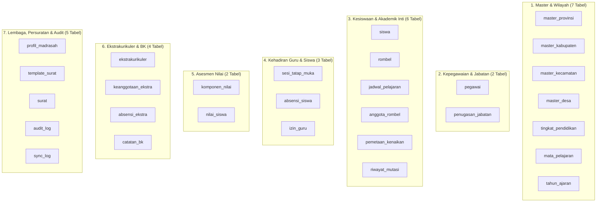

Viewed backend.md:366-376
Viewed backend.md:1-200
Viewed backend.md:201-383

Berikut adalah **Daftar Lengkap Seluruh Tabel Database dan Pemetaan File (Migration & Model)** yang telah didefinisikan dan tersedia secara resmi pada dokumen [`doc/backend.md`](file:///d:/titip%20video%20hp%20Vivo/APLIKASI/sim-madrasah-frontend/doc/backend.md) (turunan dari `SIM_Madrasah_Terpadu_SRS_v2.md` Bab 9 dan `FRONTEND.md`).

---

### 🗄️ Ringkasan Domain Database (Total 29 Tabel)

---

### 📋 Daftar Rinci Tabel per Domain, File Migration, dan Model

#### 1. Domain Master Data & Wilayah (Bab 4.1 `doc/backend.md`)
| No | Nama Tabel | File Migration Laravel (Target) | File Model Eloquent (Target) | Keterangan & Primary Key |
| :--- | :--- | :--- | :--- | :--- |
| 1 | `master_provinsi` | `database/migrations/01_create_master_provinsi_table.php` | `app/Models/MasterProvinsi.php` | `id_provinsi` (UUID PK), Data resmi Kemendagri |
| 2 | `master_kabupaten` | `database/migrations/02_create_master_kabupaten_table.php` | `app/Models/MasterKabupaten.php` | `id_kabupaten` (UUID PK), FK `id_provinsi` |
| 3 | `master_kecamatan` | `database/migrations/03_create_master_kecamatan_table.php` | `app/Models/MasterKecamatan.php` | `id_kecamatan` (UUID PK), FK `id_kabupaten` |
| 4 | `master_desa` | `database/migrations/04_create_master_desa_table.php` | `app/Models/MasterDesa.php` | `id_desa` (UUID PK), FK `id_kecamatan` |
| 5 | `tingkat_pendidikan`| `database/migrations/05_create_tingkat_pendidikan_table.php` | `app/Models/TingkatPendidikan.php` | `id_tingkat` (UUID PK), `urutan` (1–12) |
| 6 | `mata_pelajaran` | `database/migrations/06_create_mata_pelajaran_table.php` | `app/Models/MataPelajaran.php` | `id_mapel` (UUID PK), `kode_mapel`, `kelompok` |
| 7 | `tahun_ajaran` | `database/migrations/07_create_tahun_ajaran_table.php` | `app/Models/TahunAjaran.php` | `id_tahun` (UUID PK), **tanpa kolom semester** |

---

#### 2. Domain Kepegawaian & Multi-Jabatan (Bab 4.2 `doc/backend.md`)
| No | Nama Tabel | File Migration Laravel (Target) | File Model Eloquent (Target) | Aturan Kunci & Constraint |
| :--- | :--- | :--- | :--- | :--- |
| 8 | `pegawai` | `database/migrations/08_create_pegawai_table.php` | `app/Models/Pegawai.php` | `id_pegawai` (UUID PK), `nik` (Unique, Terenkripsi), `tugas_utama: Guru/Tendik` |
| 9 | `penugasan_jabatan`| `database/migrations/09_create_penugasan_jabatan_table.php`| `app/Models/PenugasanJabatan.php` | `id_penugasan` (UUID PK), Model jabatan aditif (bisa rangkap), Index: `[id_pegawai, jenis_jabatan, status]` |

---

#### 3. Domain Kesiswaan & Rombel (Bab 4.3 `doc/backend.md`)
| No | Nama Tabel | File Migration Laravel (Target) | File Model Eloquent (Target) | Aturan Kunci & Constraint |
| :--- | :--- | :--- | :--- | :--- |
| 10 | `siswa` | `database/migrations/10_create_siswa_table.php` | `app/Models/Siswa.php` | `id_siswa` (UUID PK), `nisn`, `nik` (Terenkripsi), `skor_risiko_ai` |
| 11 | `rombel` | `database/migrations/11_create_rombel_table.php` | `app/Models/Rombel.php` | `id_rombel` (UUID PK), FK `id_wali_kelas`, FK `id_tingkat`, FK `id_tahun` |
| 12 | `jadwal_pelajaran` | `database/migrations/12_create_jadwal_pelajaran_table.php` | `app/Models/JadwalPelajaran.php` | `id_jadwal` (UUID PK), Kolom `semester: Ganjil/Genap`, Unique: `[id_pegawai, hari, jam_mulai, semester]` |
| 13 | `anggota_rombel` | `database/migrations/13_create_anggota_rombel_table.php` | `app/Models/AnggotaRombel.php` | `id_anggota` (UUID PK), `tanggal_mulai`, `tanggal_selesai`, `status_persetujuan`, `diajukan_oleh`, `disetujui_oleh` |
| 14 | `pemetaan_kenaikan`| `database/migrations/14_create_pemetaan_kenaikan_table.php`| `app/Models/PemetaanKenaikan.php` | `id_pemetaan` (UUID PK), Wizard Kenaikan Kelas Massal |
| 15 | `riwayat_mutasi` | `database/migrations/15_create_riwayat_mutasi_table.php` | `app/Models/RiwayatMutasi.php` | `id_mutasi` (UUID PK), `jenis_mutasi: Masuk/Keluar`, `id_surat_skp`, `berkas_pendukung` |

---

#### 4. Domain Presensi & Kehadiran Terpadu (Bab 4.4 `doc/backend.md`)
| No | Nama Tabel | File Migration Laravel (Target) | File Model Eloquent (Target) | Aturan Kunci & Constraint |
| :--- | :--- | :--- | :--- | :--- |
| 16 | `sesi_tatap_muka` | `database/migrations/16_create_sesi_tatap_muka_table.php` | `app/Models/SesiTatapMuka.php` | `id_sesi` (UUID PK), `is_guru_pengganti`, `status_kehadiran_guru`, Unique: `[id_jadwal, tanggal]` |
| 17 | `absensi_siswa` | `database/migrations/17_create_absensi_siswa_table.php` | `app/Models/AbsensiSiswa.php` | `id_absensi` (UUID PK), **Kunci ganda Unique: `[id_siswa, id_sesi]`** |
| 18 | `izin_guru` | `database/migrations/18_create_izin_guru_table.php` | `app/Models/IzinGuru.php` | `id_izin` (UUID PK), `status_rekonsiliasi: Tepat Waktu/Terlambat` (>1x24 jam) |

---

#### 5. Domain Asesmen Nilai Akademik (Bab 4.5 `doc/backend.md`)
| No | Nama Tabel | File Migration Laravel (Target) | File Model Eloquent (Target) | Aturan Kunci & Constraint |
| :--- | :--- | :--- | :--- | :--- |
| 19 | `komponen_nilai` | `database/migrations/19_create_komponen_nilai_table.php` | `app/Models/KomponenNilai.php` | `id_komponen` (UUID PK), `bobot`, `kategori: Formatif/Sumatif/PAS` |
| 20 | `nilai_siswa` | `database/migrations/20_create_nilai_siswa_table.php` | `app/Models/NilaiSiswa.php` | `id_nilai` (UUID PK), Validasi ketat `id_pegawai_penilai` via `jadwal_pelajaran` |

---

#### 6. Domain Ekstrakurikuler & Bimbingan Konseling (Bab 4.6 `doc/backend.md`)
| No | Nama Tabel | File Migration Laravel (Target) | File Model Eloquent (Target) | Aturan Kunci & Constraint |
| :--- | :--- | :--- | :--- | :--- |
| 21 | `ekstrakurikuler` | `database/migrations/21_create_ekstrakurikuler_table.php` | `app/Models/Ekstrakurikuler.php` | `id_ekstra` (UUID PK), FK `id_pembina` ke `pegawai` |
| 22 | `keanggotaan_ekstra`| `database/migrations/22_create_keanggotaan_ekstra_table.php`| `app/Models/KeanggotaanEkstra.php` | `id_anggota_ekstra` (UUID PK), FK `id_ekstra`, FK `id_siswa` |
| 23 | `absensi_ekstra` | `database/migrations/23_create_absensi_ekstra_table.php` | `app/Models/AbsensiEkstra.php` | `id_absensi_ekstra` (UUID PK), Presensi per sesi latihan |
| 24 | `catatan_bk` | `database/migrations/24_create_catatan_bk_table.php` | `app/Models/CatatanBk.php` | `id_bk` (UUID PK), **Wajib PostgreSQL Row-Level Security (RLS)** untuk kerahasiaan kasus |

---

#### 7. Domain Lembaga, Persuratan, Audit & Sinkronisasi (Bab 4.7 & Bab 9.1 `doc/backend.md`)
| No | Nama Tabel | File Migration Laravel (Target) | File Model Eloquent (Target) | Aturan Kunci & Constraint |
| :--- | :--- | :--- | :--- | :--- |
| 25 | `profil_madrasah` | `database/migrations/25_create_profil_madrasah_table.php` | `app/Models/ProfilMadrasah.php` | `id_profil` (UUID PK), Singleton Pattern (Max 1 baris), Kop & data institusi |
| 26 | `template_surat` | `database/migrations/26_create_template_surat_table.php` | `app/Models/TemplateSurat.php` | `id_template` (UUID PK), `kode_template` (Unique), `variabel_placeholder` (jsonb) |
| 27 | `surat` | `database/migrations/27_create_surat_table.php` | `app/Models/Surat.php` | `id_surat` (UUID PK), `nomor_surat` (Unique), `meta_penandatangan` (jsonb snapshot e-Sign) |
| 28 | `audit_log` | `database/migrations/28_create_audit_log_table.php` | `app/Models/AuditLog.php` | `id_log` (UUID PK), Immutable ledger, `data_sebelum` & `data_sesudah` (jsonb) |
| 29 | `sync_log` | `database/migrations/29_create_sync_log_table.php` | `app/Models/SyncLog.php` | `id_sync` (UUID PK), Antrean sinkronisasi & outbox ekspor Verval PD / EMIS 4.0 |

---

### 🛡️ Catatan Kritis Arsitektur Database (Rules of Truth)
1. **Semester Milik `jadwal_pelajaran`**: Kolom `semester` mutlak berada di `jadwal_pelajaran`, **bukan di `tahun_ajaran`**.
2. **Kunci Absensi Siswa**: `absensi_siswa` terikat pada `(id_siswa, id_sesi)`, menjamin multi-sesi dalam satu hari dapat tercatat secara independen.
3. **Kekekalan Arsip Hukum**: Dokumen pada tabel `surat` mengunci data pejabat penandatangan dalam kolom snapshot `meta_penandatangan` (jsonb), sehingga penggantian Kepala Madrasah tidak merusak identitas surat lama yang telah terbit.

---

Searched for "BAB 9"
Searched for "Kamus Data"
Searched for "9A"
Searched for "# "
Listed directory doc
Searched for "tabel"
Viewed SIM_Madrasah_Terpadu_SRS_v2.md:1-100
Viewed SIM_Madrasah_Terpadu_SRS_v2.md:400-550
Viewed SIM_Madrasah_Terpadu_SRS_v2.md:550-650
Viewed SIM_Madrasah_Terpadu_SRS_v2.md:650-720
Searched for "master_provinsi"

Berikut adalah **Daftar Lengkap 29 Tabel Database beserta Seluruh Field/Kolomnya** yang didefinisikan secara resmi pada [`doc/backend.md`](file:///d:/titip%20video%20hp%20Vivo/APLIKASI/sim-madrasah-frontend/doc/backend.md) dan [`doc/SIM_Madrasah_Terpadu_SRS_v2.md`](file:///d:/titip%20video%20hp%20Vivo/APLIKASI/sim-madrasah-frontend/doc/SIM_Madrasah_Terpadu_SRS_v2.md) Bab 9:

---

### 1. DOMAIN MASTER & WILAYAH

**nama tabel: `master_provinsi`**
- `id_provinsi` *(UUID PK)*
- `kode_provinsi` *(string)*
- `nama_provinsi` *(string)*
- `created_at` *(timestamp)*
- `updated_at` *(timestamp)*

**nama tabel: `master_kabupaten`**
- `id_kabupaten` *(UUID PK)*
- `id_provinsi` *(UUID FK ke `master_provinsi`)*
- `kode_kabupaten` *(string)*
- `nama_kabupaten` *(string)*
- `created_at` *(timestamp)*
- `updated_at` *(timestamp)*

**nama tabel: `master_kecamatan`**
- `id_kecamatan` *(UUID PK)*
- `id_kabupaten` *(UUID FK ke `master_kabupaten`)*
- `kode_kecamatan` *(string)*
- `nama_kecamatan` *(string)*
- `created_at` *(timestamp)*
- `updated_at` *(timestamp)*

**nama tabel: `master_desa`**
- `id_desa` *(UUID PK)*
- `id_kecamatan` *(UUID FK ke `master_kecamatan`)*
- `kode_desa` *(string)*
- `nama_desa` *(string)*
- `created_at` *(timestamp)*
- `updated_at` *(timestamp)*

**nama tabel: `tingkat_pendidikan`**
- `id_tingkat` *(UUID PK)*
- `nama_tingkat` *(string, contoh: "Kelas 10")*
- `urutan` *(integer, contoh: 1–12 untuk validasi kenaikan berjenjang)*
- `created_at` *(timestamp)*
- `updated_at` *(timestamp)*

**nama tabel: `mata_pelajaran`**
- `id_mapel` *(UUID PK)*
- `kode_mapel` *(string, contoh: "BID-01")*
- `nama_mapel` *(string)*
- `kelompok` *(string / enum, contoh: "Kelompok A (Wajib)", "Kelompok B", "Muatan Lokal")*
- `created_at` *(timestamp)*
- `updated_at` *(timestamp)*

**nama tabel: `tahun_ajaran`**
- `id_tahun` *(UUID PK)*
- `nama_tahun` *(string, contoh: "2026/2027", satu tahun penuh)*
- `status_aktif` *(boolean)*
- *(Catatan: Tidak memiliki kolom `semester` karena semester milik `jadwal_pelajaran`)*
- `created_at` *(timestamp)*
- `updated_at` *(timestamp)*

---

### 2. DOMAIN KEPEGAWAIAN & JABATAN

**nama tabel: `pegawai`**
- `id_pegawai` *(UUID PK)*
- `nik` *(string 16, unique, terenkripsi di level aplikasi)*
- `nip` *(string, nullable)*
- `npk` *(string, nullable)*
- `nama_lengkap_gelar` *(string)*
- `status_kepegawaian` *(string, contoh: "PNS", "PPPK", "GTT", "PTY")*
- `tugas_utama` *(enum: 'Guru', 'Tendik')*
- `alamat_detail` *(string, nullable)*
- `id_desa` *(UUID FK ke `master_desa`, nullable)*
- `mapel_sertifikasi` *(jsonb, array id_mapel, nullable)*
- `created_at` *(timestamp)*
- `updated_at` *(timestamp)*

**nama tabel: `penugasan_jabatan`**
- `id_penugasan` *(UUID PK)*
- `id_pegawai` *(UUID FK ke `pegawai`)*
- `jenis_jabatan` *(enum: 'Kepala Madrasah', 'Admin Madrasah', 'Operator Kesiswaan', 'Guru BK')*
- `id_tahun` *(UUID FK ke `tahun_ajaran`)*
- `tanggal_mulai` *(date)*
- `tanggal_selesai` *(date, nullable - null jika masih aktif)*
- `status` *(enum: 'Aktif', 'Berakhir')*
- `created_at` *(timestamp)*
- `updated_at` *(timestamp)*

---

### 3. DOMAIN KESISWAAN & AKADEMIK INTI

**nama tabel: `siswa`**
- `id_siswa` *(UUID PK)*
- `nik` *(string 16, unique, terenkripsi di level aplikasi)*
- `nisn` *(string 10, unique)*
- `nama_lengkap` *(string)*
- `tempat_lahir` *(string)*
- `tanggal_lahir` *(date)*
- `jenis_kelamin` *(enum: 'L', 'P')*
- `agama` *(string, default: "Islam")*
- `nama_ibu_kandung` *(string)*
- `alamat_detail` *(string, nullable)*
- `id_desa` *(UUID FK ke `master_desa`, nullable)*
- `status_siswa` *(enum: 'Aktif', 'Lulus', 'Mutasi Keluar', 'Drop Out')*
- `jalur_masuk` *(string: 'PPDB Reguler', 'Mutasi Masuk', dll.)*
- `skor_risiko_ai` *(float, nullable, hanya diisi sistem AI)*
- `created_at` *(timestamp)*
- `updated_at` *(timestamp)*

**nama tabel: `rombel`**
- `id_rombel` *(UUID PK)*
- `nama_rombel` *(string, contoh: "10-A")*
- `id_tingkat` *(UUID FK ke `tingkat_pendidikan`)*
- `id_tahun` *(UUID FK ke `tahun_ajaran`)*
- `id_wali_kelas` *(UUID FK ke `pegawai`, nullable)*
- `created_at` *(timestamp)*
- `updated_at` *(timestamp)*

**nama tabel: `jadwal_pelajaran`**
- `id_jadwal` *(UUID PK)*
- `id_rombel` *(UUID FK ke `rombel`)*
- `id_pegawai` *(UUID FK ke `pegawai` - Guru Pengajar)*
- `id_mapel` *(UUID FK ke `mata_pelajaran`)*
- `semester` *(enum: 'Ganjil', 'Genap')*
- `hari` *(string, contoh: "Senin", "Selasa")*
- `jam_mulai` *(time)*
- `jam_selesai` *(time)*
- `created_at` *(timestamp)*
- `updated_at` *(timestamp)*

**nama tabel: `anggota_rombel`**
- `id_anggota` *(UUID PK)*
- `id_siswa` *(UUID FK ke `siswa`)*
- `id_rombel` *(UUID FK ke `rombel`)*
- `tanggal_mulai` *(date)*
- `tanggal_selesai` *(date, nullable - null jika masih aktif)*
- `status_keanggotaan` *(enum: 'Aktif', 'Pindah Rombel', 'Naik Kelas', 'Tinggal Kelas', 'Lulus', 'Keluar')*
- `jenis_perpindahan` *(enum: 'Awal Masuk', 'Pindah Rombel', 'Kenaikan Tingkat', 'Mutasi Masuk')*
- `status_persetujuan` *(enum: 'Tidak Perlu', 'Menunggu Persetujuan', 'Disetujui', 'Ditolak')*
- `diajukan_oleh` *(UUID FK ke `pegawai` - Operator Kesiswaan, nullable)*
- `disetujui_oleh` *(UUID FK ke `pegawai` - Kepala Madrasah, nullable)*
- `tanggal_persetujuan` *(timestamp, nullable)*
- `created_at` *(timestamp)*
- `updated_at` *(timestamp)*

**nama tabel: `pemetaan_kenaikan`**
- `id_pemetaan` *(UUID PK)*
- `id_rombel_asal` *(UUID FK ke `rombel`)*
- `id_rombel_tujuan` *(UUID FK ke `rombel`)*
- `id_tahun` *(UUID FK ke `tahun_ajaran` - Tahun Ajaran Tujuan)*
- `created_at` *(timestamp)*
- `updated_at` *(timestamp)*

**nama tabel: `riwayat_mutasi`**
- `id_mutasi` *(UUID PK)*
- `id_siswa` *(UUID FK ke `siswa`)*
- `id_tahun` *(UUID FK ke `tahun_ajaran`)*
- `jenis_mutasi` *(enum: 'Masuk', 'Keluar')*
- `sekolah_asal` *(string, nullable - diisi jika mutasi masuk)*
- `sekolah_tujuan` *(string, nullable - diisi jika mutasi keluar)*
- `tanggal_mutasi` *(date)*
- `alasan` *(text)*
- `no_surat_mutasi` *(string)*
- `id_surat_skp` *(UUID FK ke `surat`, nullable)*
- `status_persetujuan` *(enum: 'Menunggu Persetujuan', 'Disetujui', 'Ditolak')*
- `diajukan_oleh` *(UUID FK ke `pegawai` - Operator)*
- `disetujui_oleh` *(UUID FK ke `pegawai` - Kepala Madrasah, nullable)*
- `berkas_pendukung` *(jsonb, array BerkasPendukung, nullable)*
- `created_at` *(timestamp)*
- `updated_at` *(timestamp)*

---

### 4. DOMAIN KEHADIRAN GURU & SISWA

**nama tabel: `sesi_tatap_muka`**
- `id_sesi` *(UUID PK)*
- `id_jadwal` *(UUID FK ke `jadwal_pelajaran`)*
- `tanggal` *(date)*
- `id_pegawai_pelaksana` *(UUID FK ke `pegawai`, nullable - guru aktual penginput presensi)*
- `waktu_input` *(timestamp, nullable)*
- `is_guru_pengganti` *(boolean, default: false - dihitung sistem)*
- `id_izin_terkait` *(UUID FK ke `izin_guru`, nullable)*
- `jurnal_materi` *(text, nullable)*
- `status_kehadiran_guru` *(enum: 'Tepat Waktu', 'Terlambat', 'Digantikan Terjadwal', 'Digantikan Mendadak', 'Tidak Terlaksana', nullable)*
- `created_at` *(timestamp)*
- `updated_at` *(timestamp)*

**nama tabel: `absensi_siswa`**
- `id_absensi` *(UUID PK)*
- `tanggal` *(date)*
- `id_siswa` *(UUID FK ke `siswa`)*
- `id_rombel` *(UUID FK ke `rombel`)*
- `id_sesi` *(UUID FK ke `sesi_tatap_muka`)*
- `status` *(enum: 'Hadir', 'Sakit', 'Izin', 'Alpa')*
- `created_at` *(timestamp)*
- `updated_at` *(timestamp)*

**nama tabel: `izin_guru`**
- `id_izin` *(UUID PK)*
- `id_pegawai` *(UUID FK ke `pegawai`)*
- `tanggal_izin` *(date)*
- `jenis_izin` *(enum: 'Direncanakan H-1', 'Mendesak-Darurat')*
- `alasan` *(text)*
- `id_pegawai_pengganti` *(UUID FK ke `pegawai`, nullable)*
- `saluran_pelaporan` *(enum: 'Langsung/Tatap Muka', 'WA Pribadi Kepala Madrasah', 'WA Group')*
- `dilaporkan_pada` *(timestamp)*
- `status_rekonsiliasi` *(enum: 'Tepat Waktu', 'Terlambat')*
- `dicatat_oleh` *(UUID FK ke `pegawai` - Admin/Kepala Madrasah)*
- `created_at` *(timestamp)*
- `updated_at` *(timestamp)*

---

### 5. DOMAIN ASESMEN NILAI

**nama tabel: `komponen_nilai`**
- `id_komponen` *(UUID PK)*
- `id_mapel` *(UUID FK ke `mata_pelajaran`)*
- `nama_komponen` *(string, contoh: "Tugas", "UH", "UTS", "UAS")*
- `bobot` *(float)*
- `kategori` *(enum: 'Formatif', 'Sumatif', 'PAS', nullable)*
- `created_at` *(timestamp)*
- `updated_at` *(timestamp)*

**nama tabel: `nilai_siswa`**
- `id_nilai` *(UUID PK)*
- `id_siswa` *(UUID FK ke `siswa`)*
- `id_komponen` *(UUID FK ke `komponen_nilai`)*
- `id_rombel` *(UUID FK ke `rombel`)*
- `id_tahun` *(UUID FK ke `tahun_ajaran`)*
- `semester` *(enum: 'Ganjil', 'Genap')*
- `nilai` *(float)*
- `id_pegawai_penilai` *(UUID FK ke `pegawai`)*
- `created_at` *(timestamp)*
- `updated_at` *(timestamp)*

---

### 6. DOMAIN EKSTRAKURIKULER & BIMBINGAN KONSELING

**nama tabel: `ekstrakurikuler`**
- `id_ekstra` *(UUID PK)*
- `nama_ekstra` *(string, contoh: "Pramuka", "PMR", "Robotik")*
- `id_pembina` *(UUID FK ke `pegawai`)*
- `id_tahun` *(UUID FK ke `tahun_ajaran`)*
- `created_at` *(timestamp)*
- `updated_at` *(timestamp)*

**nama tabel: `keanggotaan_ekstra`**
- `id_keanggotaan` *(UUID PK)*
- `id_siswa` *(UUID FK ke `siswa`)*
- `id_ekstra` *(UUID FK ke `ekstrakurikuler`)*
- `tanggal_mulai` *(date)*
- `tanggal_selesai` *(date, nullable - null jika masih aktif)*
- `status` *(enum: 'Aktif', 'Keluar')*
- `created_at` *(timestamp)*
- `updated_at` *(timestamp)*

**nama tabel: `absensi_ekstra`**
- `id_absensi_ekstra` *(UUID PK)*
- `id_keanggotaan` *(UUID FK ke `keanggotaan_ekstra`)*
- `tanggal` *(date)*
- `status` *(enum: 'Hadir', 'Tidak Hadir')*
- `created_at` *(timestamp)*
- `updated_at` *(timestamp)*

**nama tabel: `catatan_bk`** *(Diisolasi dengan PostgreSQL Row-Level Security)*
- `id_bk` / `id_catatan` *(UUID PK)*
- `id_siswa` *(UUID FK ke `siswa`)*
- `id_pegawai_bk` *(UUID FK ke `pegawai`)*
- `tanggal` *(date)*
- `kategori` *(enum: 'Akademik', 'Perilaku', 'Pribadi', 'Sosial')*
- `catatan` *(text)*
- `tingkat_kerahasiaan` *(enum: 'Umum', 'Rahasia')*
- `created_at` *(timestamp)*
- `updated_at` *(timestamp)*

---

### 7. DOMAIN LEMBAGA, PERSURATAN, AUDIT & SINKRONISASI

**nama tabel: `profil_madrasah`** *(Singleton Guard: Maksimal 1 Baris)*
- `id_profil` *(UUID PK)*
- `nsm` *(string 12, unique)*
- `npsn` *(string 8, unique)*
- `nama_madrasah` *(string)*
- `jenjang` *(enum: 'MI', 'MTs', 'MA', 'MAK')*
- `status_akreditasi` *(enum: 'A', 'B', 'C', 'Belum Akreditasi')*
- `alamat` *(text)*
- `telepon` *(string, nullable)*
- `email` *(string, nullable)*
- `website` *(string, nullable)*
- `id_kepala_madrasah` *(UUID FK ke `pegawai`, nullable)*
- `nama_kepala_madrasah` *(string, nullable)*
- `nip_kepala_madrasah` *(string, nullable)*
- `logo_url` *(string, nullable)*
- `created_at` *(timestamp)*
- `updated_at` *(timestamp)*

**nama tabel: `template_surat`**
- `id_template` *(UUID PK)*
- `kode_template` *(string, unique, contoh: "SK-AKTIF", "ST-TUGAS")*
- `nama_template` *(string)*
- `kategori` *(string, contoh: "Keterangan", "Tugas", "Keputusan", "Rekomendasi")*
- `header_html` *(text, nullable)*
- `body_template` *(text)*
- `variabel_placeholder` *(jsonb, array placeholder, nullable)*
- `aktif` *(boolean, default: true)*
- `created_at` *(timestamp)*
- `updated_at` *(timestamp)*

**nama tabel: `surat`**
- `id_surat` *(UUID PK)*
- `nomor_surat` *(string, unique)*
- `id_template` *(UUID FK ke `template_surat`, nullable)*
- `jenis_surat` *(string)*
- `perihal` *(string)*
- `tanggal_surat` *(date)*
- `tujuan_surat` *(string)*
- `id_siswa_terkait` *(UUID FK ke `siswa`, nullable)*
- `id_pegawai_terkait` *(UUID FK ke `pegawai`, nullable)*
- `id_penandatangan` *(UUID FK ke `pegawai`, nullable)*
- `isi_surat` *(text)*
- `status` *(enum: 'Draf', 'Menunggu TTD', 'Diterbitkan', 'Ditolak', 'Diarsipkan')*
- `meta_penandatangan` *(jsonb, nullable, snapshot: { nama, nip, jabatan, tanggal_ttd, hash_esign })*
- `dibuat_oleh` *(UUID FK ke `pegawai`)*
- `created_at` *(timestamp)*
- `updated_at` *(timestamp)*

**nama tabel: `audit_log`**
- `id_log` *(UUID PK)*
- `id_user` *(UUID FK ke `pegawai`)*
- `nama_tabel` *(string)*
- `id_record` *(string)*
- `aksi` *(enum/string: 'Create', 'Update', 'Delete', 'Approve', 'Reject')*
- `data_sebelum` *(jsonb, nullable)*
- `data_sesudah` *(jsonb, nullable)*
- `timestamp` *(datetime / timestamp)*
- `created_at` *(timestamp)*
- `updated_at` *(timestamp)*

**nama tabel: `sync_log`**
- `id_sync` *(UUID PK)*
- `modul` *(string, contoh: "VervalPD", "EMIS_GTK", "Mutasi_Keluar")*
- `status` *(enum: 'Sukses', 'Gagal', 'Pending')*
- `jumlah_record` *(integer)*
- `pesan_log` *(text, nullable)*
- `timestamp` *(datetime / timestamp)*
- `created_at` *(timestamp)*
- `updated_at` *(timestamp)*

---

### 🛡️ Panduan Arsitektural & Batasan AI Agen (Anti-Drift Guard)

Bagi seluruh agen AI dan pengembang backend yang mengerjakan repositori ini:

1. **Prinsip Efisiensi Skema & Integritas Data (Anti-Bloat Guard):**
   - **Perhitungan Predikat Nilai Dinamis:** Rentang predikat huruf (A, B, C, D) dihitung dinamis di `NilaiService` menggunakan rumus baku Kemenag: $\text{Interval} = (100 - \text{KKM}) / 3$ tanpa memerlukan tabel fisik tambahan.
   - **Penguncian Nilai (*Grade Lock*):** Penguncian nilai akademik dikendalikan melalui `NilaiPolicy` dan endpoint `POST /api/v1/nilai/lock-rombel` berdasarkan siklus otorisasi Kepala Madrasah.
   - **Legalitas Prestasi & Penghargaan:** Seluruh rekam jejak prestasi, piagam, dan penghargaan siswa diterbitkan dan disimpan secara terpusat dan berkekuatan hukum pada modul `surat` (lengkap dengan snapshot `meta_penandatangan`).
   - **Pemberian Tugas Bersifat Aditif:** Wali kelas adalah FK langsung pada `rombel.id_wali_kelas`, dan hak akses struktural dikelola secara aditif pada `penugasan_jabatan`.

2. **Kepatuhan SSoT:**
   - Seluruh nama field database **wajib snake_case** dan merujuk persis pada 29 tabel di atas serta [`doc/backend.md`](file:///d:/titip%20video%20hp%20Vivo/APLIKASI/sim-madrasah-frontend/doc/backend.md).
   - Jangan menambahkan kolom `semester` pada tabel `tahun_ajaran` (semester adalah atribut jadwal pelajaran).